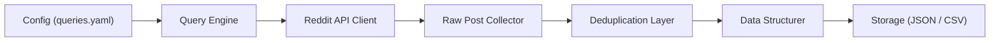
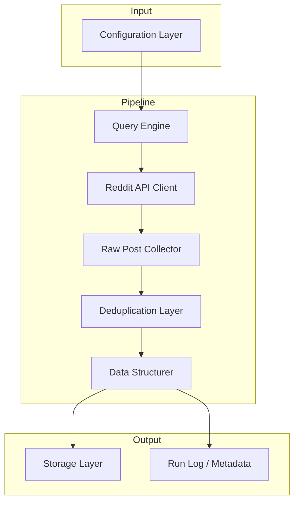
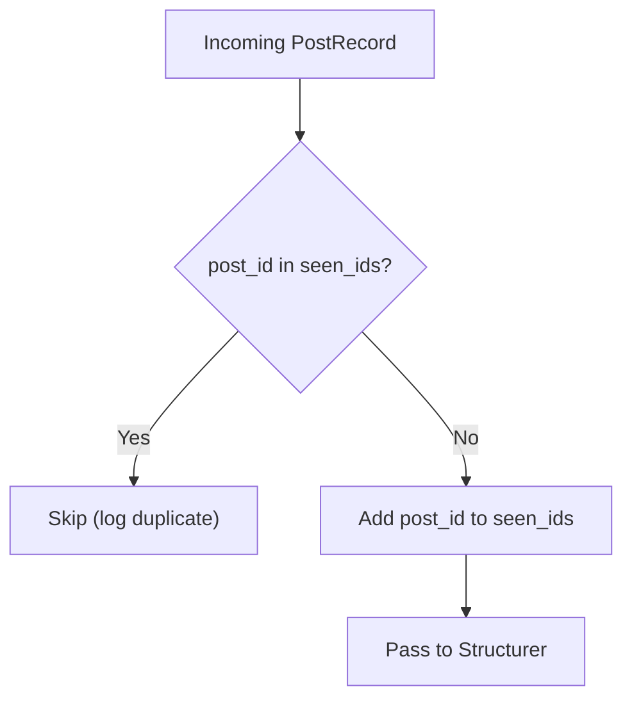
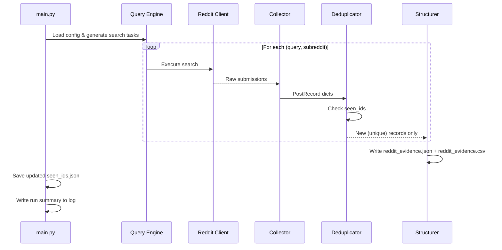
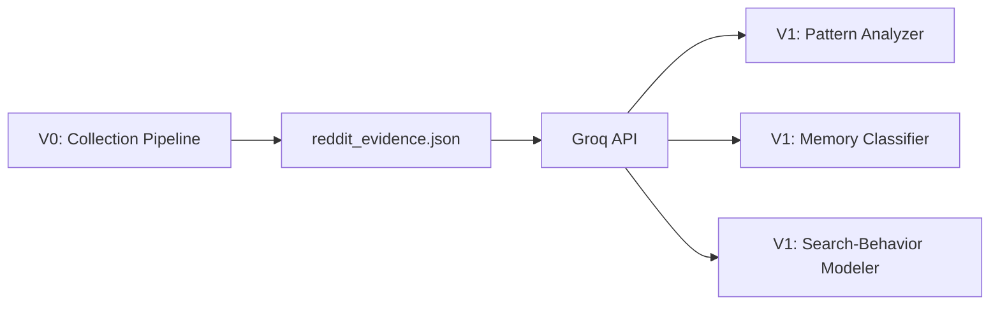

# Architecture Plan — V0 Reddit Research Data-Retrieval System

## 1. System Overview

This document describes the architecture of the V0 research data-retrieval system for the Google Photos vague-memory retrieval project. The system searches Reddit for conversations where users describe struggling to locate old photos, videos, screenshots, or documents, and organizes those conversations into a structured, deduplicated dataset.



---

## 2. High-Level Architecture

The system follows a **pipeline architecture** with five sequential stages. Each stage has a single responsibility and communicates with the next through well-defined data structures.



---

## 3. Component Breakdown

### 3.1 Configuration Layer

| Aspect       | Detail                                                                 |
| ------------ | ---------------------------------------------------------------------- |
| **Purpose**  | Externalize all tuneable parameters so nothing is hard-coded           |
| **File**     | `config/queries.yaml`                                                  |
| **Format**   | YAML                                                                   |

**Contents:**

```yaml
# config/queries.yaml
reddit:
  client_id: "${REDDIT_CLIENT_ID}"
  client_secret: "${REDDIT_CLIENT_SECRET}"
  user_agent: "vague-memory-research/0.1"

search:
  queries:
    - "can't find old photo"
    - "looking for an old screenshot"
    - "remember a photo but can't find it"
    - "can't remember when I took a photo"
    - "lost photo in gallery"
    - "trying to find a picture I took"
  subreddits:                        # optional scope limiter
    - "googlephotos"
    - "photography"
    - "AskReddit"
    - "techsupport"
    - "Android"
    - "iphone"
  max_results_per_query: 100
  sort: "relevance"                  # relevance | new | top
  time_filter: "all"                 # hour | day | week | month | year | all

storage:
  output_dir: "data/output"
  format: "json"                     # json | csv
  dedupe_index: "data/seen_ids.json"

logging:
  level: "INFO"
  log_file: "logs/run.log"
```

---

### 3.2 Query Engine

| Aspect           | Detail                                                        |
| ---------------- | ------------------------------------------------------------- |
| **Purpose**      | Reads config, builds search requests, and dispatches them     |
| **Input**        | Parsed config (queries + subreddits + parameters)             |
| **Output**       | Iterator of `(query_string, subreddit, params)` tuples        |
| **Module**       | `src/query_engine.py`                                         |

**Responsibilities:**

- Load and validate `queries.yaml`
- Generate the Cartesian product of `queries × subreddits` (if subreddits are specified) or global searches
- Yield search tasks to the Reddit API Client one at a time (lazy iteration to limit memory)
- Respect rate-limit settings

---

### 3.3 Reddit Client (Dual-Mode: Keyless Public RSS + Authenticated PRAW)

| Aspect           | Detail                                                        |
| ---------------- | ------------------------------------------------------------- |
| **Purpose**      | Communicates with Reddit to retrieve posts matching search tasks |
| **Input**        | A search task `(query, subreddit, params)`                    |
| **Output**       | List of normalized submission records or raw post objects     |
| **Module**       | `src/reddit_client.py`                                        |
| **Backends**     | 1. **Keyless Public RSS** (`requests` + Atom XML parser) — requires no keys<br/>2. **PRAW OAuth** (`praw`) — activated when credentials exist in `.env` |

**Responsibilities:**

- Automatically detect mode based on `.env` credentials (falls back to Keyless RSS if credentials are absent)
- For Keyless RSS: Query `https://www.reddit.com/r/{subreddit}/search.rss`, parse Atom feed XML, strip HTML formatting, and enforce polite request throttling (2.0s delay)
- For PRAW: Authenticate using OAuth2 credentials and fetch via Reddit API
- Surface network / HTTP errors gracefully with retries and clear logging
- Return normalized raw post objects to the collector

---

### 3.4 Raw Post Collector

| Aspect           | Detail                                                        |
| ---------------- | ------------------------------------------------------------- |
| **Purpose**      | Extracts and normalises fields from raw Reddit submissions    |
| **Input**        | Raw `Submission` objects from PRAW                            |
| **Output**       | List of `PostRecord` dicts                                    |
| **Module**       | `src/collector.py`                                            |

**`PostRecord` schema:**

```python
@dataclass
class PostRecord:
    post_id: str              # Reddit unique ID (e.g. "t3_abc123")
    title: str                # Post title
    selftext: str             # Post body / self-text
    author: str               # Username (anonymised if needed)
    subreddit: str            # Source subreddit name
    created_utc: str          # ISO-8601 timestamp
    score: int                # Upvote score at collection time
    num_comments: int         # Comment count at collection time
    permalink: str            # Full URL to the original post
    search_query: str         # The query that surfaced this post
    collected_at: str         # ISO-8601 timestamp of collection
    top_comments: list[str]   # Top-level comments (first N)
```

**Responsibilities:**

- Map PRAW submission attributes → `PostRecord` fields
- Fetch top-level comments (configurable depth / count)
- Normalise timestamps to ISO-8601 UTC
- Handle deleted / removed posts gracefully (skip or flag)

---

### 3.5 Deduplication Layer

| Aspect           | Detail                                                        |
| ---------------- | ------------------------------------------------------------- |
| **Purpose**      | Ensures no post appears more than once in the output          |
| **Input**        | Stream of `PostRecord` dicts                                  |
| **Output**       | Deduplicated stream of `PostRecord` dicts                     |
| **Module**       | `src/deduplicator.py`                                         |

**Strategy:**



- **Primary key**: `post_id` (Reddit's unique submission ID)
- **Persistence**: `seen_ids.json` — a flat JSON file of previously seen IDs, loaded at the start of each run and saved at the end. This enables deduplication across multiple runs.
- **In-memory set**: For fast O(1) lookups during a single run.
- **Logging**: Records how many duplicates were skipped per query.

---

### 3.6 Data Structurer & Storage Layer

| Aspect           | Detail                                                        |
| ---------------- | ------------------------------------------------------------- |
| **Purpose**      | Serialises deduplicated records into the output format        |
| **Input**        | Deduplicated `PostRecord` stream                              |
| **Output**       | JSON file and/or CSV file on disk                             |
| **Module**       | `src/structurer.py`                                           |

**Output formats supported:**

| Format | File                               | Use case                            |
| ------ | ---------------------------------- | ----------------------------------- |
| JSON   | `data/output/reddit_evidence.json` | Primary — preserves nested comments |
| CSV    | `data/output/reddit_evidence.csv`  | Flat view for spreadsheets / pandas |

**JSON structure:**

```json
{
  "metadata": {
    "generated_at": "2026-09-16T20:00:00Z",
    "total_posts": 312,
    "queries_used": 6,
    "duplicates_skipped": 47
  },
  "records": [
    {
      "record_id": "RD_000001",
      "source_id": "t3_abc123",
      "title": "Can't find a photo from my trip...",
      "raw_text": "I remember taking a photo at...",
      "author": "user123",
      "subreddit": "googlephotos",
      "created_at": "2025-03-12T14:23:00Z",
      "score": 45,
      "num_comments": 12,
      "url": "https://reddit.com/r/googlephotos/comments/abc123/...",
      "queries_matched": ["can't find old photo"],
      "query_used": "can't find old photo",
      "retrieved_at": "2026-09-16T20:00:00Z",
      "top_comments": [
        "Have you tried searching by location?",
        "Google Photos search is terrible for this..."
      ]
    }
  ]
}
```

---

## 4. Directory Structure

```
project-root/
├── config/
│   └── queries.yaml              # All configurable parameters
├── data/
│   ├── output/
│   │   ├── reddit_evidence.json  # Structured output (JSON)
│   │   ├── reddit_evidence.csv   # Structured output (CSV)
│   │   └── collection_report.json# Quality & metrics report
│   └── seen_ids.json             # Deduplication index
├── docs/
│   ├── problem-statement.txt     # Original problem statement
│   ├── context.md                # Project context summary
│   └── architecture.md           # This document
├── logs/
│   └── run.log                   # Runtime logs
├── src/
│   ├── __init__.py
│   ├── main.py                   # Entry point — orchestrates the pipeline
│   ├── query_engine.py           # Reads config, generates search tasks
│   ├── reddit_client.py          # PRAW wrapper, handles auth + search
│   ├── collector.py              # Extracts & normalises post fields
│   ├── deduplicator.py           # Filters duplicates by post_id
│   └── structurer.py             # Serialises output to JSON / CSV
├── tests/
│   ├── test_query_engine.py
│   ├── test_collector.py
│   ├── test_deduplicator.py
│   └── test_structurer.py
├── .env                          # Reddit API credentials (git-ignored)
├── .gitignore
├── requirements.txt
└── README.md
```

---

## 5. Data Flow



---

## 6. Technology Stack

| Layer             | Technology                         | Rationale                                    |
| ----------------- | ---------------------------------- | -------------------------------------------- |
| **Language**      | Python 3.11+                       | Rich ecosystem, rapid prototyping            |
| **Reddit API**    | PRAW 7.x                          | Official wrapper; handles OAuth & rate limits |
| **LLM (V1)**     | Groq API via `groq` SDK             | Ultra-fast LLM inference; serves Llama 3.3, Mixtral |
| **Config**        | PyYAML                            | Human-readable, widely supported             |
| **Data**          | Python `dataclasses` + `json`      | Lightweight, no ORM overhead for V0          |
| **CSV export**    | Python `csv` (stdlib)              | Zero dependencies                            |
| **Env vars**      | python-dotenv                      | Secure credential management                 |
| **Logging**       | Python `logging` (stdlib)          | Built-in, configurable                       |
| **Testing**       | pytest                             | Industry standard                            |

### `requirements.txt`

```
praw>=7.7,<8.0
pyyaml>=6.0
python-dotenv>=1.0
groq>=0.11
pytest>=7.0
```

> **Note:** The `groq` SDK is the official Python client for the Groq inference API. V0 installs the dependency and configures the API key; V1 will use it for LLM-powered analysis.

---

## 7. Error Handling Strategy

| Scenario                        | Handling                                                       |
| ------------------------------- | -------------------------------------------------------------- |
| Invalid / missing credentials   | Fail fast with clear error message; do not proceed             |
| Rate limit exceeded             | PRAW auto-retries; log the wait time                           |
| Network timeout                 | Retry up to 3 times with exponential back-off, then skip query |
| Deleted / removed post          | Skip the post; log a warning                                   |
| Malformed config file           | Validate on load; raise `ConfigError` with line reference      |
| Disk write failure              | Fail with error; do not silently lose data                     |
| Duplicate post detected         | Skip silently; increment duplicate counter in run summary      |

---

## 8. Logging & Observability

Each run produces a log file (`logs/run.log`) and a summary block in the JSON output metadata.

**Log events include:**

- Run start / end timestamps
- Number of queries executed
- Posts collected per query
- Duplicates skipped per query
- Errors and retries
- Total posts written to output

**Example log output:**

```
2026-09-16 20:00:01 INFO  Starting collection run
2026-09-16 20:00:01 INFO  Loaded 6 search queries across 6 subreddits
2026-09-16 20:00:03 INFO  Query "can't find old photo" in r/googlephotos → 42 posts
2026-09-16 20:00:05 INFO  Query "can't find old photo" in r/photography → 18 posts (3 duplicates skipped)
...
2026-09-16 20:02:30 INFO  Run complete: 312 unique posts collected, 47 duplicates skipped
```

---

## 9. Security & Privacy Considerations

| Concern                  | Mitigation                                                        |
| ------------------------ | ----------------------------------------------------------------- |
| API credentials          | Stored in `.env`, never committed to version control              |
| Groq API key             | Stored in `.env` as `GROQ_API_KEY`; never hard-coded              |
| User PII                 | Only public Reddit usernames are stored; no private data accessed |
| Data retention           | Output stored locally; no external transmission                   |
| Rate limiting            | PRAW respects Reddit's API terms of service automatically         |
| Groq API rate limiting   | Groq rate limits respected; retry with backoff in V1              |

---

## 10. Extensibility — Path to V1 (Groq-Powered Analysis)

The architecture is designed so V1 analysis can be layered on top without modifying V0. **Groq** is the designated LLM inference provider for all V1 analysis modules.



### Groq Integration Details

| Aspect               | Detail                                                              |
| -------------------- | ------------------------------------------------------------------- |
| **Provider**         | Groq (https://console.groq.com)                                     |
| **Models**           | `llama-3.3-70b-versatile`, `mixtral-8x7b-32768`, `gemma2-9b-it`    |
| **Default model**    | `llama-3.3-70b-versatile`                                           |
| **SDK**              | `groq` Python SDK (official)                                        |
| **Auth**             | API key via `GROQ_API_KEY` environment variable                     |
| **Base URL**         | `https://api.groq.com/openai/v1` (handled by SDK)                   |
| **V0 scope**         | Dependency installed + API key configured; no LLM calls in V0      |
| **V1 scope**         | Pattern analysis, memory classification, search-behavior modelling  |

### Groq Client Configuration (prepared in V0)

```python
from groq import Groq

client = Groq(
    api_key=os.environ["GROQ_API_KEY"],
)

# Example V1 usage:
response = client.chat.completions.create(
    model="llama-3.3-70b-versatile",
    messages=[{"role": "user", "content": "Analyze this post..."}],
)
```

### V1 Extension Points

- **V1 modules** read from `reddit_evidence.json` as their input — no coupling to the collection pipeline.
- **Groq** processes each post through prompt templates for classification, pattern extraction, and behaviour analysis.
- New data sources (e.g., Twitter, forums) can be added by implementing a new API client that outputs the same `EvidenceRecord` schema.
- New output formats (e.g., SQLite, BigQuery export) can be added as new structurer backends.

---

## 11. Verification Plan

### Automated Tests

| Test suite                  | What it validates                                      |
| --------------------------- | ------------------------------------------------------ |
| `test_query_engine.py`      | Config loading, query generation, edge cases           |
| `test_collector.py`         | Field extraction, timestamp normalisation, deleted posts|
| `test_deduplicator.py`      | Duplicate detection, persistence across runs           |
| `test_structurer.py`        | JSON/CSV output schema, metadata accuracy              |

```bash
pytest tests/ -v
```

### Manual Verification

1. Run the pipeline with a small query set (2 queries, 10 results each)
2. Inspect `reddit_evidence.json` for correct schema and field population
3. Re-run with the same queries — verify zero new posts (all deduplicated)
4. Add a new query — verify only genuinely new posts are appended
5. Spot-check `url` links to confirm they link to the correct Reddit posts
