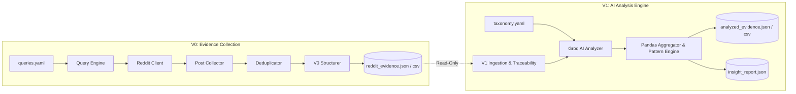
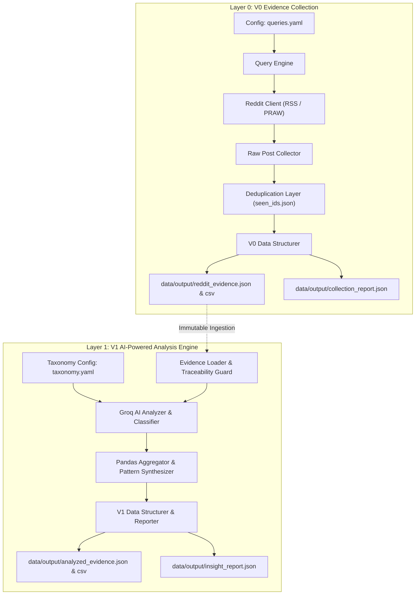
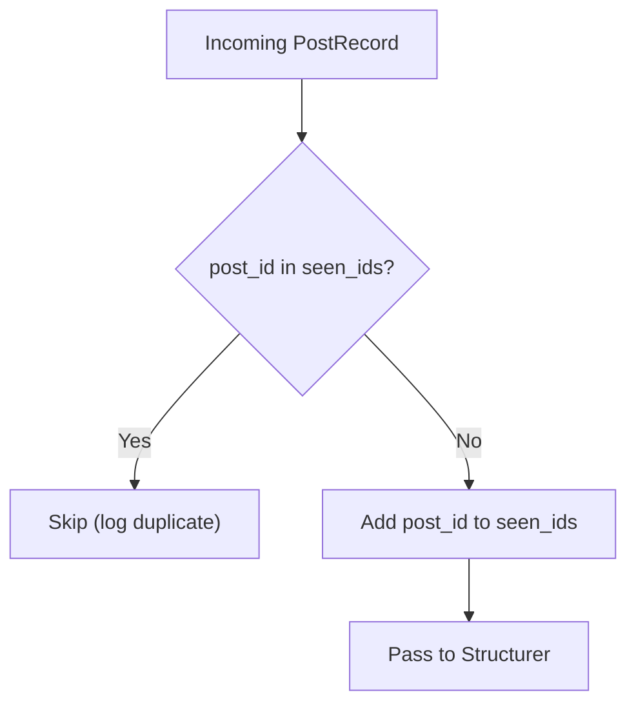
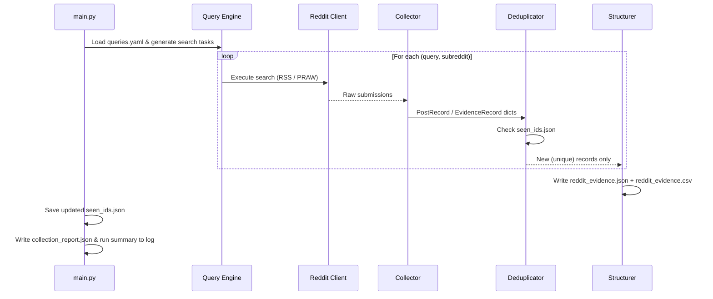
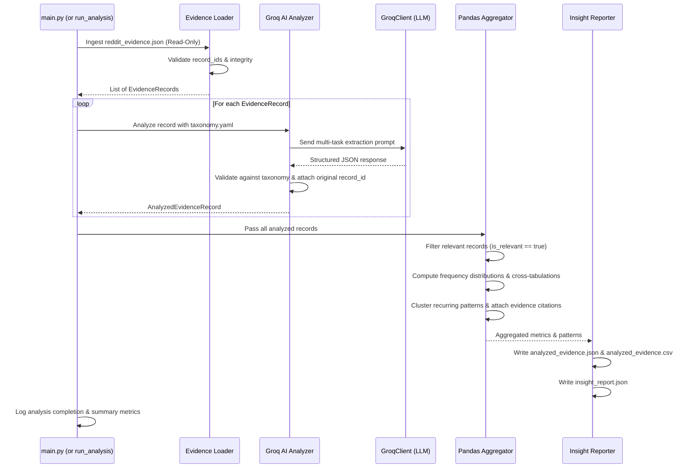
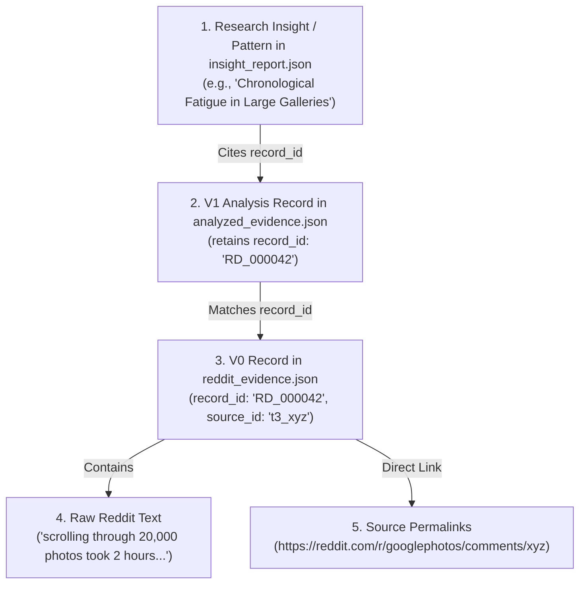

# Architecture Plan — V0 & V1 Research System

## 1. System Overview

This document describes the unified architecture of the **Google Photos Vague-Memory Research System**, spanning two decoupled, sequential layers:

1. **V0 — Evidence Collection Pipeline**: Discovers and gathers public Reddit conversations where users describe struggling to locate old photos, videos, screenshots, or documents when they cannot precisely describe what they are looking for. Deduplicates and formats raw evidence into an untouched baseline dataset.
2. **V1 — AI-Powered Research Analysis Engine**: Ingests the V0 dataset and uses the Groq LLM infrastructure alongside a configurable taxonomy (`config/taxonomy.yaml`) to transform raw conversations into structured, evidence-backed research insights. Investigates the core research question:
   > *"Why does photo retrieval fail when users remember a photo or its context, but cannot precisely describe it to the search system?"*


```mermaid
graph LR
    subgraph V0_Collection ["V0: Evidence Collection"]
        A["queries.yaml"] --> B["Query Engine"]
        B --> C["Reddit Client"]
        C --> D["Post Collector"]
        D --> E["Deduplicator"]
        E --> F["V0 Structurer"]
        F --> G[("reddit_evidence.json / csv")]
    end

    subgraph V1_Analysis ["V1: AI Analysis Engine"]
        G -. Read-Only .-> H["V1 Ingestion & Traceability"]
        TAX["taxonomy.yaml"] --> I["Groq AI Analyzer"]
        H --> I
        I --> J["Pandas Aggregator & Pattern Engine"]
        J --> K[("analyzed_evidence.json / csv")]
        J --> L[("insight_report.json")]
    end
```

---

## 2. High-Level Architecture

The system follows a **two-layer pipeline architecture**. Each layer has distinct responsibilities, and V1 treats V0 output strictly as immutable input, preserving the original `record_id` across every stage to maintain an unbroken traceability chain:

$$\text{Research Insight} \longrightarrow \text{V1 Analysis} \longrightarrow \text{V0 Record} \longrightarrow \text{Original Reddit Evidence} \longrightarrow \text{Source URL}$$


```mermaid
flowchart TD
    subgraph Layer0 ["Layer 0: V0 Evidence Collection"]
        CFG0["Config: queries.yaml"] --> QE["Query Engine"]
        QE --> RC["Reddit Client (RSS / PRAW)"]
        RC --> COL["Raw Post Collector"]
        COL --> DD["Deduplication Layer (seen_ids.json)"]
        DD --> STR0["V0 Data Structurer"]
        STR0 --> OUT0["data/output/reddit_evidence.json & csv"]
        STR0 --> REP0["data/output/collection_report.json"]
    end

    subgraph Layer1 ["Layer 1: V1 AI-Powered Analysis Engine"]
        OUT0 -. Immutable Ingestion .-> ING["Evidence Loader & Traceability Guard"]
        CFG1["Taxonomy Config: taxonomy.yaml"] --> AN["Groq AI Analyzer & Classifier"]
        ING --> AN
        AN --> AGG["Pandas Aggregator & Pattern Synthesizer"]
        AGG --> STR1["V1 Data Structurer & Reporter"]
        STR1 --> OUT1["data/output/analyzed_evidence.json & csv"]
        STR1 --> REP1["data/output/insight_report.json"]
    end
```


---

## 3. Component Breakdown

### 3.1 Configuration Layer

| Aspect       | Detail                                                                 |
| ------------ | ---------------------------------------------------------------------- |
| **Purpose**  | Externalize all tuneable parameters so nothing is hard-coded           |
| **File**     | `config/queries.yaml`                                                  |
| **Format**   | YAML                                                                   |

**Contents:**

```yaml
# config/queries.yaml
reddit:
  client_id: "${REDDIT_CLIENT_ID}"
  client_secret: "${REDDIT_CLIENT_SECRET}"
  user_agent: "vague-memory-research/0.1"

search:
  queries:
    - "can't find old photo"
    - "looking for an old screenshot"
    - "remember a photo but can't find it"
    - "can't remember when I took a photo"
    - "lost photo in gallery"
    - "trying to find a picture I took"
  subreddits:                        # optional scope limiter
    - "googlephotos"
    - "photography"
    - "AskReddit"
    - "techsupport"
    - "Android"
    - "iphone"
  max_results_per_query: 100
  sort: "relevance"                  # relevance | new | top
  time_filter: "all"                 # hour | day | week | month | year | all

storage:
  output_dir: "data/output"
  format: "json"                     # json | csv
  dedupe_index: "data/seen_ids.json"

logging:
  level: "INFO"
  log_file: "logs/run.log"
```

---

### 3.2 Query Engine

| Aspect           | Detail                                                        |
| ---------------- | ------------------------------------------------------------- |
| **Purpose**      | Reads config, builds search requests, and dispatches them     |
| **Input**        | Parsed config (queries + subreddits + parameters)             |
| **Output**       | Iterator of `(query_string, subreddit, params)` tuples        |
| **Module**       | `src/query_engine.py`                                         |

**Responsibilities:**

- Load and validate `queries.yaml`
- Generate the Cartesian product of `queries × subreddits` (if subreddits are specified) or global searches
- Yield search tasks to the Reddit API Client one at a time (lazy iteration to limit memory)
- Respect rate-limit settings

---

### 3.3 Reddit Client (Dual-Mode: Keyless Public RSS + Authenticated PRAW)

| Aspect           | Detail                                                        |
| ---------------- | ------------------------------------------------------------- |
| **Purpose**      | Communicates with Reddit to retrieve posts matching search tasks |
| **Input**        | A search task `(query, subreddit, params)`                    |
| **Output**       | List of normalized submission records or raw post objects     |
| **Module**       | `src/reddit_client.py`                                        |
| **Backends**     | 1. **Keyless Public RSS** (`requests` + Atom XML parser) — requires no keys<br/>2. **PRAW OAuth** (`praw`) — activated when credentials exist in `.env` |

**Responsibilities:**

- Automatically detect mode based on `.env` credentials (falls back to Keyless RSS if credentials are absent)
- For Keyless RSS: Query `https://www.reddit.com/r/{subreddit}/search.rss`, parse Atom feed XML, strip HTML formatting, and enforce polite request throttling (2.0s delay)
- For PRAW: Authenticate using OAuth2 credentials and fetch via Reddit API
- Surface network / HTTP errors gracefully with retries and clear logging
- Return normalized raw post objects to the collector

---

### 3.4 Raw Post Collector

| Aspect           | Detail                                                        |
| ---------------- | ------------------------------------------------------------- |
| **Purpose**      | Extracts and normalises fields from raw Reddit submissions    |
| **Input**        | Raw `Submission` objects from PRAW                            |
| **Output**       | List of `PostRecord` dicts                                    |
| **Module**       | `src/collector.py`                                            |

**`PostRecord` schema:**

```python
@dataclass
class PostRecord:
    post_id: str              # Reddit unique ID (e.g. "t3_abc123")
    title: str                # Post title
    selftext: str             # Post body / self-text
    author: str               # Username (anonymised if needed)
    subreddit: str            # Source subreddit name
    created_utc: str          # ISO-8601 timestamp
    score: int                # Upvote score at collection time
    num_comments: int         # Comment count at collection time
    permalink: str            # Full URL to the original post
    search_query: str         # The query that surfaced this post
    collected_at: str         # ISO-8601 timestamp of collection
    top_comments: list[str]   # Top-level comments (first N)
```

**Responsibilities:**

- Map PRAW submission attributes → `PostRecord` fields
- Fetch top-level comments (configurable depth / count)
- Normalise timestamps to ISO-8601 UTC
- Handle deleted / removed posts gracefully (skip or flag)

---

### 3.5 Deduplication Layer

| Aspect           | Detail                                                        |
| ---------------- | ------------------------------------------------------------- |
| **Purpose**      | Ensures no post appears more than once in the output          |
| **Input**        | Stream of `PostRecord` dicts                                  |
| **Output**       | Deduplicated stream of `PostRecord` dicts                     |
| **Module**       | `src/deduplicator.py`                                         |

**Strategy:**


```mermaid
flowchart TD
    IN["Incoming PostRecord"] --> CHECK{"post_id in seen_ids?"}
    CHECK -- Yes --> SKIP["Skip (log duplicate)"]
    CHECK -- No --> ADD["Add post_id to seen_ids"]
    ADD --> PASS["Pass to Structurer"]
```

- **Primary key**: `post_id` (Reddit's unique submission ID)
- **Persistence**: `seen_ids.json` — a flat JSON file of previously seen IDs, loaded at the start of each run and saved at the end. This enables deduplication across multiple runs.
- **In-memory set**: For fast O(1) lookups during a single run.
- **Logging**: Records how many duplicates were skipped per query.

---

### 3.6 Data Structurer & Storage Layer

| Aspect           | Detail                                                        |
| ---------------- | ------------------------------------------------------------- |
| **Purpose**      | Serialises deduplicated records into the output format        |
| **Input**        | Deduplicated `PostRecord` stream                              |
| **Output**       | JSON file and/or CSV file on disk                             |
| **Module**       | `src/structurer.py`                                           |

**Output formats supported:**

| Format | File                               | Use case                            |
| ------ | ---------------------------------- | ----------------------------------- |
| JSON   | `data/output/reddit_evidence.json` | Primary — preserves nested comments |
| CSV    | `data/output/reddit_evidence.csv`  | Flat view for spreadsheets / pandas |

**JSON structure:**

```json
{
  "metadata": {
    "generated_at": "2026-09-16T20:00:00Z",
    "total_posts": 312,
    "queries_used": 6,
    "duplicates_skipped": 47
  },
  "records": [
    {
      "record_id": "RD_000001",
      "source_id": "t3_abc123",
      "title": "Can't find a photo from my trip...",
      "raw_text": "I remember taking a photo at...",
      "author": "user123",
      "subreddit": "googlephotos",
      "created_at": "2025-03-12T14:23:00Z",
      "score": 45,
      "num_comments": 12,
      "url": "https://reddit.com/r/googlephotos/comments/abc123/...",
      "queries_matched": ["can't find old photo"],
      "query_used": "can't find old photo",
      "retrieved_at": "2026-09-16T20:00:00Z",
      "top_comments": [
        "Have you tried searching by location?",
        "Google Photos search is terrible for this..."
      ]
    }
  ]
}
```

---

### 3.7 V1 Configuration Layer (`config/taxonomy.yaml`)

| Aspect       | Detail                                                                 |
| ------------ | ---------------------------------------------------------------------- |
| **Purpose**  | Externalize all research categories, cue types, and failure taxonomies |
| **File**     | `config/taxonomy.yaml`                                                 |
| **Format**   | YAML                                                                   |

The research taxonomy is fully configurable so classification rubrics can evolve as new evidence emerges without modifying analysis code.

**Schema:**

```yaml
# config/taxonomy.yaml
version: "1.0"
description: "Research taxonomy for Google Photos vague-memory retrieval"

relevance_criteria:
  - "User is searching for visual media (photo, video, screenshot, scan)"
  - "User exhibits vague, partial, or imprecise memory of the item"
  - "User describes search failure, friction, or manual workarounds"

memory_cues:
  categories:
    - id: "person"
      description: "People, faces, relationships, or groups depicted"
    - id: "place_location"
      description: "Geographic places, landmarks, rooms, or travel spots"
    - id: "event_occasion"
      description: "Weddings, trips, birthdays, parties, holidays, concerts"
    - id: "temporal_epoch"
      description: "Approximate year, season, life stage (e.g. 'college years', 'old phone')"
    - id: "object"
      description: "Physical items, cars, clothes, pets, food, devices"
    - id: "visual_details"
      description: "Colors, lighting, framing, composition, blurriness, angles"
    - id: "text_in_image"
      description: "Memes, screenshots of text, receipts, book pages, signs"
    - id: "activity_action"
      description: "Sports, dancing, eating, laughing, walking, fixing"
    - id: "ambient_context"
      description: "Weather, mood, emotional state, background music, companionship"

retrieval_failure_points:
  categories:
    - id: "vocabulary_mismatch"
      description: "User search query does not match AI or metadata labels"
    - id: "temporal_fuzziness"
      description: "User cannot recall exact date/month; timeline scrolling fails"
    - id: "missing_metadata"
      description: "No geotag, EXIF stripped, or device migration lost timestamps"
    - id: "visual_semantic_gap"
      description: "Concept is abstract or compositional (e.g., 'me looking silly')"
    - id: "screenshot_clutter"
      description: "Target item drowned in thousands of untagged screenshots"
    - id: "volume_overload"
      description: "Gallery too large (10k+ photos) to browse manually"

target_media_types:
  - "personal_photo"
  - "screenshot"
  - "video_clip"
  - "document_receipt"
  - "meme_saved_image"
  - "scanned_physical_photo"

workaround_types:
  - id: "endless_scrolling"
    description: "Brute-force scrolling through timeline for hours"
  - id: "external_social_backup"
    description: "Searching Facebook, Instagram, or WhatsApp chat logs for sent copy"
  - id: "peer_inquiry"
    description: "Asking friends/family if they have a copy of the photo"
  - id: "reverse_image_search"
    description: "Using Google Lens or TinEye if a similar image is available"
  - id: "keyword_guessing"
    description: "Repeatedly typing adjacent keywords hoping the system hits"
  - id: "abandonment"
    description: "Giving up and assuming the memory is lost forever"

friction_types:
  - "time_wasted"
  - "frustration_with_search_tool"
  - "fear_of_memory_loss"
  - "cognitive_overload"
  - "device_storage_anxiety"

groq_analysis:
  model: "llama-3.3-70b-versatile"
  temperature: 0.1
  max_retries: 3
  timeout_seconds: 30
  batch_size: 1
```

---

### 3.8 V1 Evidence Ingestion & Traceability Layer

| Aspect           | Detail                                                               |
| ---------------- | -------------------------------------------------------------------- |
| **Purpose**      | Loads V0 source evidence and enforces strict immutability & tracking |
| **Input**        | `data/output/reddit_evidence.json` (V0 source)                       |
| **Output**       | Stream of verified `EvidenceRecord` items                            |
| **Module**       | `src/evidence_loader.py`                                             |

**Responsibilities:**
- Read-only loading of `reddit_evidence.json`.
- Strict validation that `record_id` (e.g., `RD_000001`) and `source_id` exist and are valid.
- Invariant guarantee: The original V0 dataset file is never overwritten, modified, or truncated.
- Maintains the unbroken traceability chain from raw evidence to final insight.

---

### 3.9 V1 Groq AI Analyzer & Multi-Task Classifier

| Aspect           | Detail                                                                 |
| ---------------- | ---------------------------------------------------------------------- |
| **Purpose**      | Uses Groq LLM inference to perform structured research classification |
| **Input**        | `EvidenceRecord` + `taxonomy.yaml`                                     |
| **Output**       | `AnalyzedEvidenceRecord` dict                                          |
| **Module**       | `src/analyzer.py` (powered by `src/groq_client.py`)                    |

**Extraction & Classification Tasks:**
1. **Relevance Filter**:
   - `is_relevant: bool`
   - `relevance_confidence: float` (0.0 to 1.0)
   - `relevance_reasoning: str`
2. **Memory Cue Extraction**:
   - `memory_cues: list[str]` (mapped to taxonomy IDs: `person`, `place_location`, `event_occasion`, etc.)
   - `memory_cue_details: dict` (extracts specific quotes: e.g. `{"place_location": "beach in San Diego", "temporal_epoch": "summer before college"}`)
3. **Target Media Classification**:
   - `target_media: str` (`personal_photo`, `screenshot`, `video_clip`, etc.)
4. **Retrieval Failure Point**:
   - `failure_point: str` (taxonomy ID, e.g. `temporal_fuzziness`, `vocabulary_mismatch`)
   - `failure_evidence: str` (quote from user conversation)
5. **Friction & Workaround Extraction**:
   - `workarounds: list[str]` (e.g. `endless_scrolling`, `peer_inquiry`, `abandonment`)
   - `friction: list[str]` (e.g. `time_wasted`, `fear_of_memory_loss`)
6. **Desired Outcome**:
   - `desired_outcome: str` (what the user was trying to achieve, e.g., "show a funny picture to coworker", "print album for grandmother")

---

### 3.10 V1 Aggregation & Pattern Engine (Pandas)

| Aspect           | Detail                                                               |
| ---------------- | -------------------------------------------------------------------- |
| **Purpose**      | Computes research statistics, frequency distributions, and patterns  |
| **Input**        | List of `AnalyzedEvidenceRecord` dicts                               |
| **Output**       | Research metrics and recurring pattern matrices                      |
| **Module**       | `src/aggregator.py`                                                  |

**Responsibilities (using Pandas):**
- Filter to relevant evidence subset (`is_relevant == True`).
- Compute frequency distributions for:
  - Top memory cues retained by users
  - Primary retrieval failure points
  - Most common user workarounds
  - Media types with highest search failure rates
- Multi-dimensional cross-tabulations:
  - `memory_cues` vs. `failure_point`
  - `target_media` vs. `workaround`
- Recurring Problem Pattern Identification:
  - Groups evidence into clustered research themes (e.g., *"Users remembering life-stage epochs struggling with chronological flat-galleries"*).
  - Calculates pattern prevalence (% of relevant records) and attaches supporting evidence citations (`record_id` list).

---

### 3.11 V1 Data Structurer & Insight Reporter

| Aspect           | Detail                                                               |
| ---------------- | -------------------------------------------------------------------- |
| **Purpose**      | Serializes analyzed evidence and compiles the final insight report   |
| **Input**        | Analyzed records and aggregated patterns                             |
| **Output**       | `analyzed_evidence.json`, `analyzed_evidence.csv`, `insight_report.json` |
| **Module**       | `src/insight_reporter.py`                                            |

**Responsibilities:**
- Export `analyzed_evidence.json` (canonical machine-readable full dataset with both V0 fields and V1 analysis fields).
- Export `analyzed_evidence.csv` (flattened tabular view for manual spreadsheet inspection, with zero text truncation).
- Generate `insight_report.json` (executive summary, quantitative distributions, recurring patterns, and traceable user evidence citations).

---

### 3.12 V1 Data Schemas & Artifacts

#### A. Analyzed Evidence Record (`analyzed_evidence.json`)

```json
{
  "record_id": "RD_000001",
  "source_id": "t3_abc123",
  "title": "Can't find a photo from my trip...",
  "raw_text": "I remember taking a photo at a beach bonfire in 2018 with my college roommate, but scrolling through 20,000 photos took 2 hours and I couldn't find it...",
  "url": "https://reddit.com/r/googlephotos/comments/abc123/...",
  "author": "user123",
  "subreddit": "googlephotos",
  "created_at": "2025-03-12T14:23:00Z",
  "retrieved_at": "2026-09-16T20:00:00Z",
  "queries_matched": ["can't find old photo"],
  "analysis": {
    "is_relevant": true,
    "relevance_confidence": 0.95,
    "relevance_reasoning": "User describes clear failure retrieving a personal photo using partial episodic memory.",
    "target_media": "personal_photo",
    "memory_cues_present": ["person", "place_location", "activity_action", "temporal_epoch"],
    "memory_cue_details": {
      "person": "college roommate",
      "place_location": "beach",
      "activity_action": "bonfire",
      "temporal_epoch": "2018 / college"
    },
    "retrieval_failure_point": "volume_overload",
    "failure_evidence": "scrolling through 20,000 photos took 2 hours and I couldn't find it",
    "workarounds_used": ["endless_scrolling"],
    "friction_experienced": ["time_wasted", "frustration_with_search_tool"],
    "desired_outcome": "Show photo to friend / reminisce"
  }
}
```

#### B. Aggregated Insight Report (`insight_report.json`)

```json
{
  "report_metadata": {
    "generated_at": "2026-09-25T14:00:00Z",
    "v0_source_file": "data/output/reddit_evidence.json",
    "total_records_ingested": 312,
    "relevant_evidence_count": 248,
    "relevance_rate": 0.795,
    "groq_model_used": "llama-3.3-70b-versatile"
  },
  "research_question": "Why does photo retrieval fail when users remember a photo or its context, but cannot precisely describe it to the search system?",
  "distributions": {
    "top_memory_cues": {
      "temporal_epoch": 182,
      "person": 145,
      "place_location": 128,
      "activity_action": 94,
      "object": 73,
      "text_in_image": 52
    },
    "retrieval_failure_points": {
      "temporal_fuzziness": 98,
      "volume_overload": 82,
      "vocabulary_mismatch": 41,
      "missing_metadata": 17,
      "screenshot_clutter": 10
    },
    "top_workarounds": {
      "endless_scrolling": 142,
      "peer_inquiry": 46,
      "external_social_backup": 38,
      "abandonment": 22
    }
  },
  "recurring_patterns": [
    {
      "pattern_id": "PAT_001",
      "name": "Chronological Fatigue in Large Galleries",
      "prevalence_count": 82,
      "prevalence_percentage": 33.1,
      "summary": "Users retain episodic memory (who, what, rough era) but lack exact timestamps; timeline search forces hours of manual scrolling that leads to fatigue or abandonment.",
      "supporting_evidence": [
        {
          "record_id": "RD_000001",
          "url": "https://reddit.com/r/googlephotos/comments/abc123/...",
          "quote": "scrolling through 20,000 photos took 2 hours and I couldn't find it"
        }
      ]
 ## 4. Directory Structure

```text
project-root/
├── config/
│   ├── queries.yaml              # V0 search queries and collection parameters
│   └── taxonomy.yaml             # V1 research taxonomy and classification categories
├── data/
│   ├── output/
│   │   ├── reddit_evidence.json  # V0 source evidence (canonical JSON)
│   │   ├── reddit_evidence.csv   # V0 source evidence (flat CSV)
│   │   ├── collection_report.json# V0 collection statistics & metrics
│   │   ├── analyzed_evidence.json# V1 analyzed records with V0 record_ids
│   │   ├── analyzed_evidence.csv # V1 analyzed records (flat CSV for review)
│   │   └── insight_report.json   # V1 aggregated research patterns & findings
│   └── seen_ids.json             # V0 deduplication index
├── Docs/
│   ├── problem-statement.txt     # Original V0 problem statement
│   ├── problemstatementp2.txt    # V1 AI Research Analysis problem statement
│   ├── context.md                # Project context & research scope
│   ├── architecture.md           # This unified architecture document
│   └── implementation.md         # Phased implementation plan
├── logs/
│   └── run.log                   # Runtime logs
├── src/
│   ├── __init__.py
│   ├── main.py                   # Orchestrator (supports collection and analysis runs)
│   ├── config_loader.py          # Loads queries.yaml and taxonomy.yaml
│   ├── query_engine.py           # V0: Generates search tasks from config
│   ├── reddit_client.py          # V0: Dual-mode Reddit client (RSS + PRAW)
│   ├── collector.py              # V0: Post extractor and normalizer
│   ├── deduplicator.py           # V0: Seen IDs tracker and deduplicator
│   ├── cleaner.py                # Text normalization and preview generator
│   ├── models.py                 # V0 EvidenceRecord & V1 AnalyzedEvidenceRecord schemas
│   ├── evidence_loader.py        # V1: Ingests V0 data with immutability guarantees
│   ├── groq_client.py            # Groq API client wrapper & health checks
│   ├── analyzer.py               # V1: AI classification & multi-task prompt engine
│   ├── aggregator.py             # V1: Pandas statistical & pattern aggregation
│   ├── insight_reporter.py       # V1: Synthesizes insight_report.json
│   ├── reporter.py               # V0: Collection report generator
│   ├── structurer.py             # Output serialization to JSON / CSV
│   └── logger_setup.py           # Logging configuration
├── tests/
│   ├── test_config_loader.py     # Config loading tests
│   ├── test_reddit_client.py     # Reddit client tests
│   ├── test_collector.py         # Collector and normalization tests
│   ├── test_deduplicator.py      # Deduplication logic tests
│   ├── test_structurer.py        # Output serialization tests
│   ├── test_groq_client.py       # Groq client wrapper tests
│   ├── test_analyzer.py          # V1 AI analyzer and prompt parsing tests
│   ├── test_aggregator.py        # V1 Pandas aggregation & pattern tests
│   ├── test_insight_reporter.py  # V1 insight report generation tests
│   ├── test_traceability.py      # V0 -> V1 record_id traceability verification
│   └── test_edge_cases.py        # Boundary conditions and malformed data tests
├── .env                          # Local credentials (git-ignored)
├── .env.example                  # Template credentials
├── .gitignore
├── requirements.txt
└── README.md
```

---

## 5. Data Flow

### 5.1 V0 Evidence Collection Flow


```mermaid
sequenceDiagram
    participant Main as main.py
    participant QE as Query Engine
    participant RC as Reddit Client
    participant COL as Collector
    participant DD as Deduplicator
    participant STR as Structurer

    Main->>QE: Load queries.yaml & generate search tasks
    loop For each (query, subreddit)
        QE->>RC: Execute search (RSS / PRAW)
        RC-->>COL: Raw submissions
        COL->>DD: PostRecord / EvidenceRecord dicts
        DD->>DD: Check seen_ids.json
        DD-->>STR: New (unique) records only
    end
    STR->>STR: Write reddit_evidence.json + reddit_evidence.csv
    Main->>Main: Save updated seen_ids.json
    Main->>Main: Write collection_report.json & run summary to log
```

### 5.2 V1 AI Research Analysis Engine Flow


```mermaid
sequenceDiagram
    participant Main as main.py (or run_analysis)
    participant EL as Evidence Loader
    participant AN as Groq AI Analyzer
    participant GC as GroqClient (LLM)
    participant AGG as Pandas Aggregator
    participant IR as Insight Reporter

    Main->>EL: Ingest reddit_evidence.json (Read-Only)
    EL->>EL: Validate record_ids & integrity
    EL-->>Main: List of EvidenceRecords
    loop For each EvidenceRecord
        Main->>AN: Analyze record with taxonomy.yaml
        AN->>GC: Send multi-task extraction prompt
        GC-->>AN: Structured JSON response
        AN->>AN: Validate against taxonomy & attach original record_id
        AN-->>Main: AnalyzedEvidenceRecord
    end
    Main->>AGG: Pass all analyzed records
    AGG->>AGG: Filter relevant records (is_relevant == true)
    AGG->>AGG: Compute frequency distributions & cross-tabulations
    AGG->>AGG: Cluster recurring patterns & attach evidence citations
    AGG-->>IR: Aggregated metrics & patterns
    IR->>IR: Write analyzed_evidence.json & analyzed_evidence.csv
    IR->>IR: Write insight_report.json
    Main->>Main: Log analysis completion & summary metrics
```

---

## 6. Technology Stack

| Layer | Technology | Rationale |
| ----- | ---------- | --------- |
| **Language** | Python 3.11+ | High productivity, rich scientific & data processing libraries |
| **Reddit Ingestion (V0)** | Dual-mode: RSS Atom + PRAW 7.x | Zero-credential default with optional OAuth power |
| **AI Inference (V1)** | Groq API (`groq` SDK) | Ultra-fast inference with `llama-3.3-70b-versatile` |
| **Configuration** | PyYAML | Human-readable configuration for `queries.yaml` & `taxonomy.yaml` |
| **Data Processing (V1)** | Pandas (or Python stdlib) | Efficient grouping, counting patterns, cross-tabulations, distributions |
| **Data Serialization** | Python `json` + `csv` | File-based storage; machine-readable and spreadsheet-compatible |
| **Environment** | python-dotenv | Secure local credential management via `.env` |
| **Testing** | pytest | Robust unit, integration, and mocking framework |

### `requirements.txt`

```text
praw>=7.7,<8.0
pyyaml>=6.0
python-dotenv>=1.0
groq>=0.11
pandas>=2.0
pytest>=7.0
```

### Explicit Architectural Boundaries: What V1 Does NOT Build

To maintain research focus and avoid premature engineering overhead, V1 strictly excludes:
- **No Vector Databases**: No Pinecone, Chroma, Weaviate, or Qdrant.
- **No Embeddings Generation**: No sentence-transformers or embedding API calls.
- **No RAG**: No chunking, vector indexing, or retrieval-augmented generation.
- **No Heavy Agent Frameworks**: No LangChain, LangGraph, AutoGen, or CrewAI.
- **No UI / Dashboards**: No Streamlit, Dash, or web frontends.
- **No External Search Integrations**: No Google Photos API or cloud drive integrations.
- **No AI Query Expansion**: No automated prompt rewriting for Reddit search.
- **No Solution Recommendations**: No MVP features, UI prototypes, or app logic.

---

## 7. Error Handling Strategy

| Scenario | Layer | Handling Strategy |
| -------- | ----- | ----------------- |
| Invalid / missing Reddit creds | V0 | Fall back to keyless RSS feeds; fail fast if RSS is blocked |
| Reddit rate limit (429) | V0 | Exponential backoff (RSS 2s pause; PRAW auto-handles) |
| Missing `reddit_evidence.json` | V1 | Fail fast with explicit instruction to run V0 collection first |
| Groq API rate limit (429) | V1 | Retry with exponential backoff (initial 2s, max 3 retries) |
| Groq API network timeout | V1 | Log warning, retry once; if failed, mark record as `analysis_failed` |
| Malformed LLM JSON response | V1 | Clean markdown code fences; validate keys; fallback to regex recovery |
| Category outside taxonomy | V1 | Coerce to closest taxonomy term or classify as `other` |
| Disk write failure | V0 / V1 | Fail fast with descriptive error; never silently lose data |

---

## 8. Logging & Observability

Both V0 and V1 emit structured log records to console and `logs/run.log`.

### Log Events Include:
- **V0 Collection**:
  - Run start / stop timestamps
  - Query executed and subreddit queried
  - Posts retrieved and duplicates filtered
  - Deduplication index updates
- **V1 Analysis**:
  - Records ingested from `reddit_evidence.json`
  - Per-record analysis progress (e.g. `[42/312] Analyzed RD_000042 (Relevant: True)`)
  - Groq API latency and token consumption metrics
  - Aggregation statistics: relevant count, top failure mode, recurring pattern count
  - Artifacts generated (`analyzed_evidence.json`, `analyzed_evidence.csv`, `insight_report.json`)

---

## 9. Security & Privacy Considerations

| Concern | Mitigation |
| ------- | ---------- |
| **API Credentials** | Both `REDDIT_CLIENT_ID/SECRET` and `GROQ_API_KEY` stored exclusively in `.env` (git-ignored). |
| **User Privacy** | Public usernames can be anonymized in research exports; no private or authentication data accessed. |
| **Data Retention** | All evidence and insight reports are stored locally in `data/output/`. |
| **Traceability Integrity** | V0 source data is marked read-only during V1 execution; V1 outputs link to V0 via `record_id`. |
| **Prompt Safety** | LLM prompts treat Reddit text strictly as untrusted data in delimited text blocks to prevent prompt injection. |

---

## 10. AI Analysis Engine & Traceability Contract

### 10.1 Traceability Architecture

Every research insight produced by V1 is anchored directly to empirical user statements through a five-stage verification chain:


```mermaid
flowchart TD
    RI["1. Research Insight / Pattern in insight_report.json\n(e.g., 'Chronological Fatigue in Large Galleries')"]
    V1A["2. V1 Analysis Record in analyzed_evidence.json\n(retains record_id: 'RD_000042')"]
    V0R["3. V0 Record in reddit_evidence.json\n(record_id: 'RD_000042', source_id: 't3_xyz')"]
    RAW["4. Raw Reddit Text\n('scrolling through 20,000 photos took 2 hours...')"]
    URL["5. Source Permalinks\n(https://reddit.com/r/googlephotos/comments/xyz)"]

    RI -->|Cites record_id| V1A
    V1A -->|Matches record_id| V0R
    V0R -->|Contains| RAW
    V0R -->|Direct Link| URL
```

### 10.2 Multi-Task AI Prompting Architecture

The V1 Analyzer sends a single structured prompt per evidence record to Groq (`llama-3.3-70b-versatile`) requesting a JSON response conforming to `taxonomy.yaml`.

```text
[System]
You are a senior qualitative UX researcher studying photo-retrieval failures.
Analyze the following user post based strictly on the provided research taxonomy.
Do not hallucinate details not stated in the evidence.

[Taxonomy Definition]
{memory_cues, retrieval_failure_points, workaround_types, friction_types}

[User Conversation Evidence]
Title: {title}
Text: {cleaned_text}
Comments: {top_comments}

[Output Requirements]
Return valid JSON matching the AnalyzedEvidenceRecord schema.
```

### 10.3 Path to V2

```text
V0: Evidence Collection  ──▶  "What are users saying?" (Raw Reddit Data)
          │
          ▼
V1: Evidence Analysis    ──▶  "Why does retrieval break?" (Taxonomy, Patterns, Insights)
          │
          ▼
V2: Solution & Prototype ──▶  "How do we solve it?" (Vague-memory search prototype, MVP)
```

---

## 11. Verification Plan

### Automated Test Matrix

| Test Suite | Validates | Layer |
| ---------- | --------- | ----- |
| `test_config_loader.py` | Validates `queries.yaml` & `taxonomy.yaml` loading | V0 + V1 |
| `test_reddit_client.py` | Keyless RSS & PRAW search backends | V0 |
| `test_collector.py` | Field extraction, comment parsing, text cleaning | V0 |
| `test_deduplicator.py` | Deduplication across queries and persistent runs | V0 |
| `test_structurer.py` | Serialization of V0 JSON and CSV | V0 |
| `test_groq_client.py` | Groq API client initialization, health check, backoff | V0 + V1 |
| `test_analyzer.py` | Prompt construction, JSON response parsing, taxonomy mapping | V1 |
| `test_aggregator.py` | Frequency calculation, cross-tabulations, pattern detection | V1 |
| `test_insight_reporter.py` | Correct schema & statistics in `insight_report.json` | V1 |
| `test_traceability.py` | Verifies `record_id` integrity and V0 immutability | V1 |
| `test_edge_cases.py` | Non-relevant posts, empty bodies, emojis, corrupted files | V0 + V1 |

### Manual Verification Procedure

1. **V0 Baseline**: Run V0 collection to produce `data/output/reddit_evidence.json`.
2. **V1 Dry Run**: Run V1 analysis on a 5-record sample using `--sample 5`.
3. **Traceability Spot-Check**: Pick 3 recurring patterns from `insight_report.json`, resolve their cited `record_id`s in `analyzed_evidence.json` and `reddit_evidence.json`, and open their source Reddit URLs in a browser.
4. **Immutability Check**: Verify that `reddit_evidence.json` hash remains unchanged after running V1 analysis.
5. **Schema Conformance**: Verify `analyzed_evidence.json` and `insight_report.json` validate against their declared JSON schemas.

