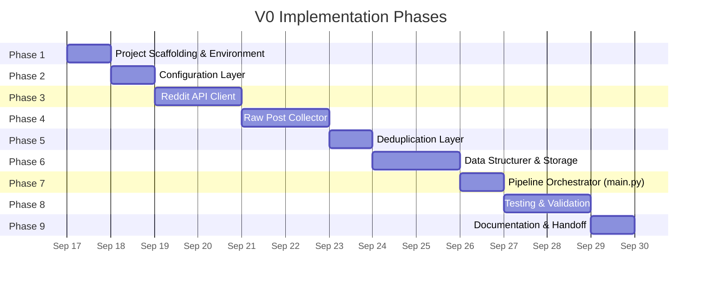
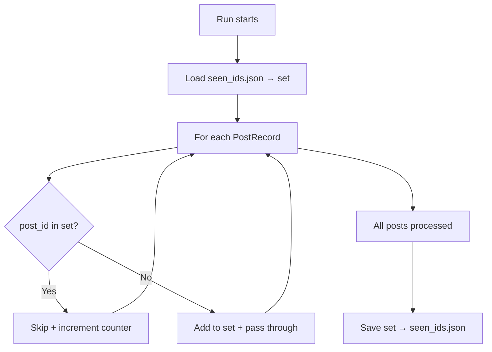
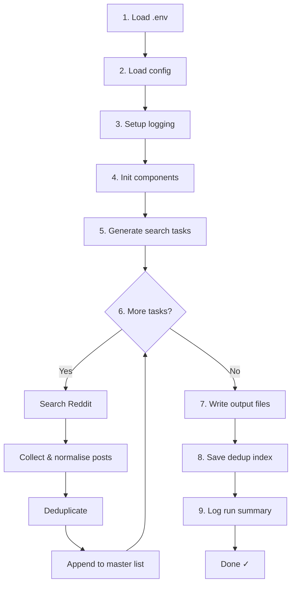

# Implementation Plan — V0 Reddit Research Data-Retrieval System

> **Reference Documents:**
> - [context.md](file:///c:/Users/kumar/Desktop/New%20folder%20(4)/Docs/context.md) — Project context & scope
> - [architecture.md](file:///c:/Users/kumar/Desktop/New%20folder%20(4)/Docs/architecture.md) — System architecture & component design

---

## Phase Overview



| Phase | Name                              | Duration | Dependencies     |
| ----- | --------------------------------- | -------- | ---------------- |
| 1     | Project Scaffolding & Environment | 1 day    | —                |
| 2     | Configuration Layer               | 1 day    | Phase 1          |
| 3     | Reddit API Client                 | 2 days   | Phase 2          |
| 4     | Raw Post Collector                | 2 days   | Phase 3          |
| 5     | Deduplication Layer               | 1 day    | Phase 4          |
| 6     | Data Structurer & Storage         | 2 days   | Phase 5          |
| 7     | Pipeline Orchestrator             | 1 day    | Phases 2–6       |
| 8     | Testing & Validation              | 2 days   | Phase 7          |
| 9     | Documentation & Handoff           | 1 day    | Phase 8          |
| **Total** |                               | **~13 days** |              |

---

## Phase 1 — Project Scaffolding & Environment Setup

### Objective
Set up the repository structure, virtual environment, dependencies, and developer tooling so all subsequent phases can build on a stable foundation.

### Tasks

#### 1.1 Create directory structure

```
project-root/
├── config/
├── data/
│   └── output/
├── Docs/
│   ├── problem-statement.txt      (existing)
│   ├── context.md                 (existing)
│   ├── architecture.md            (existing)
│   └── implementation.md          (this document)
├── logs/
├── src/
│   └── __init__.py
├── tests/
├── .env.example
├── .gitignore
├── requirements.txt
└── README.md
```

#### 1.2 Initialize Python environment

```bash
python -m venv .venv
.venv\Scripts\activate          # Windows
pip install --upgrade pip
```

#### 1.3 Create `requirements.txt`

```
praw>=7.7,<8.0
pyyaml>=6.0
python-dotenv>=1.0
groq>=0.11
pytest>=7.0
```

> **Note:** The `groq` SDK is the official Python client for the Groq inference API. V0 installs the dependency and configures the API key; V1 will use it for LLM-powered analysis.

```bash
pip install -r requirements.txt
```

#### 1.4 Create `.gitignore`

```gitignore
# Virtual environment
.venv/

# Credentials
.env

# Output data (large, regenerable)
data/output/
data/seen_ids.json

# Logs
logs/

# Python
__pycache__/
*.pyc
*.pyo
```

#### 1.5 Create `.env.example`

```env
REDDIT_CLIENT_ID=your_client_id_here
REDDIT_CLIENT_SECRET=your_client_secret_here
REDDIT_USER_AGENT=vague-memory-research/0.1
GROQ_API_KEY=your_groq_api_key_here
```

### Exit Criteria

- [ ] All directories exist
- [ ] Virtual environment activates and all dependencies install without errors
- [ ] `.gitignore` excludes credentials and generated data
- [ ] Repository initialised with `git init` and first commit

---

## Phase 2 — Configuration Layer

### Objective
Build the YAML-based configuration system so every tuneable parameter is externalised and validated at load time.

### Files to Create

| File                       | Purpose                                |
| -------------------------- | -------------------------------------- |
| `config/queries.yaml`      | All runtime configuration              |
| `src/config_loader.py`     | Loads, validates, and exposes config   |

### Tasks

#### 2.1 Create `config/queries.yaml`

Full configuration file as specified in [architecture.md § 3.1](file:///c:/Users/kumar/Desktop/New%20folder%20(4)/Docs/architecture.md):

```yaml
reddit:
  client_id: "${REDDIT_CLIENT_ID}"
  client_secret: "${REDDIT_CLIENT_SECRET}"
  user_agent: "vague-memory-research/0.1"

search:
  queries:
    - "can't find old photo"
    - "looking for an old screenshot"
    - "remember a photo but can't find it"
    - "can't remember when I took a photo"
    - "lost photo in gallery"
    - "trying to find a picture I took"
  subreddits:
    - "googlephotos"
    - "photography"
    - "AskReddit"
    - "techsupport"
    - "Android"
    - "iphone"
  max_results_per_query: 100
  sort: "relevance"
  time_filter: "all"

storage:
  output_dir: "data/output"
  format: "json"
  dedupe_index: "data/seen_ids.json"

groq:
  api_key: "${GROQ_API_KEY}"
  model: "llama-3.3-70b-versatile"
  enabled: false                     # Set to true in V1; V0 only configures

logging:
  level: "INFO"
  log_file: "logs/run.log"
```

#### 2.2 Implement `src/config_loader.py`

```python
# Responsibilities:
# - Load queries.yaml
# - Substitute ${ENV_VAR} placeholders with os.environ values
# - Detect Reddit access mode: "praw" if client_id & client_secret are provided;
#   otherwise "keyless_rss" (public RSS search feeds)
# - Validate required fields: reddit.user_agent, search.queries (non-empty list)
# - Parse groq config section (api_key, model, enabled)
# - Warn if groq.api_key is missing — V0 doesn't require it
# - Raise ConfigError with descriptive message on validation failure
# - Return a frozen config object (dataclass or namedtuple)
```

**Key design decisions:**

| Decision                        | Rationale                                            |
| ------------------------------- | ---------------------------------------------------- |
| Env-var substitution in loader  | Keeps secrets out of YAML; `.env` loaded via dotenv  |
| Dual Reddit access mode         | Supports Keyless Public RSS without API credentials; activates PRAW if keys exist |
| Fail-fast validation            | Prevents pipeline from running with bad config       |
| Frozen config object            | Prevents accidental mutation during pipeline run     |

#### 2.3 Write `tests/test_config_loader.py`

| Test case                              | Validates                                       |
| -------------------------------------- | ----------------------------------------------- |
| `test_load_valid_config_praw`          | Happy path with PRAW credentials                |
| `test_load_valid_config_keyless`       | Happy path with missing keys -> keyless mode    |
| `test_empty_queries_raises`            | ConfigError when query list is empty             |
| `test_missing_user_agent_raises`       | ConfigError when user_agent is missing          |
| `test_env_var_substitution`            | `${VAR}` placeholders replaced with env values   |
| `test_default_values`                  | Optional fields use sensible defaults            |
| `test_malformed_yaml_raises`           | ConfigError on unparseable YAML                  |
| `test_groq_config_parsed`              | Groq section parsed with api_key, model         |
| `test_missing_groq_key_warns`          | Warning (not error) if GROQ_API_KEY is absent   |

### Exit Criteria

- [ ] `config_loader.py` loads and validates `queries.yaml`
- [ ] Environment variable substitution works
- [ ] Mode detection works (`keyless_rss` vs `praw`)
- [ ] Groq config section parsed correctly (with missing-key warning)
- [ ] All test cases pass

---

## Phase 3 — Reddit Client (Dual-Mode)

### Objective
Build the client that queries Reddit for posts matching given queries, supporting both Keyless Public RSS mode (default) and authenticated PRAW mode.

### Files to Create

| File                       | Purpose                                |
| -------------------------- | -------------------------------------- |
| `src/reddit_client.py`     | Client supporting Keyless RSS & PRAW   |

### Tasks

#### 3.1 Implement `RedditClient` class
- Supports `search(query, subreddit, sort, limit)`
- If in `keyless_rss` mode: queries `https://www.reddit.com/r/{subreddit}/search.rss?q={query}&restrict_sr=1&sort={sort}`, parses Atom feed XML, extracts clean text, and enforces polite 2-second rate-throttling between queries.
- If in `praw` mode: uses PRAW `subreddit.search(...)`.
- `validate_connection()` verifies connectivity.

    def validate_connection(self) -> bool:
        """
        Verify authentication is working.
        Called once at startup before running any queries.
        """
```

#### 3.2 Error handling details

| Error                    | Response                                                   |
| ------------------------ | ---------------------------------------------------------- |
| `prawcore.OAuthException`| Log error, raise `AuthenticationError`, halt pipeline      |
| `prawcore.RequestException`| Retry up to 3× with exponential backoff (1s, 2s, 4s)    |
| `prawcore.ServerError`   | Retry up to 3× then skip query, log warning               |
| Rate limit (429)         | PRAW auto-handles; log the wait duration                   |

#### 3.3 Write `tests/test_reddit_client.py`

| Test case                              | Validates                                        |
| -------------------------------------- | ------------------------------------------------ |
| `test_successful_auth`                 | Client initialises with valid credentials        |
| `test_invalid_credentials_raises`      | AuthenticationError raised on bad creds          |
| `test_search_returns_submissions`      | Search returns list of Submission-like objects    |
| `test_subreddit_scoped_search`         | Results come from the specified subreddit        |
| `test_global_search_fallback`          | Global search works when subreddit is None       |
| `test_retry_on_network_error`          | Client retries transient errors before failing   |

> **Note:** Tests should use PRAW's `pytest` fixtures or mocked Reddit instances to avoid hitting the live API during CI.

### Exit Criteria

- [ ] `RedditClient` authenticates and searches successfully against real Reddit API (manual test with `.env`)
- [ ] All 6 unit tests pass with mocked PRAW
- [ ] Rate limiting and retry logic verified via mocked transient errors

---

## Phase 4 — Raw Post Collector

### Objective
Extract and normalise fields from raw PRAW submissions into the `PostRecord` data structure, including top-level comments.

### Files to Create

| File                       | Purpose                                        |
| -------------------------- | ---------------------------------------------- |
| `src/models.py`            | `PostRecord` dataclass definition              |
| `src/collector.py`         | Field extraction and normalisation logic        |

### Tasks

#### 4.1 Define `PostRecord` in `src/models.py`

```python
from dataclasses import dataclass, field, asdict
from typing import Optional

@dataclass
class PostRecord:
    post_id: str                       # e.g. "t3_abc123"
    title: str
    selftext: str
    author: str
    subreddit: str
    created_utc: str                   # ISO-8601
    score: int
    num_comments: int
    permalink: str                     # Full URL
    search_query: str
    collected_at: str                  # ISO-8601
    top_comments: list[str] = field(default_factory=list)

    def to_dict(self) -> dict:
        return asdict(self)
```

#### 4.2 Implement `PostCollector` in `src/collector.py`

```python
class PostCollector:
    """Converts raw PRAW Submission objects into PostRecord instances."""

    def __init__(self, max_comments: int = 5):
        """
        Args:
            max_comments: Number of top-level comments to collect per post.
        """

    def collect(self, submission, search_query: str) -> PostRecord | None:
        """
        Extract fields from a single PRAW Submission.
        Returns None if the post is deleted/removed.

        Steps:
        1. Check if submission is deleted/removed → return None
        2. Extract post_id, title, selftext, author (handle [deleted])
        3. Convert created_utc float → ISO-8601 string
        4. Build full permalink URL
        5. Fetch top N top-level comments (replace MoreComments)
        6. Generate collected_at timestamp
        7. Return PostRecord
        """

    def collect_batch(self, submissions, search_query: str) -> list[PostRecord]:
        """
        Process a list of submissions, skipping deleted posts.
        Logs count of skipped posts.
        """
```

#### 4.3 Field mapping reference

| PRAW Attribute          | PostRecord Field     | Transformation                              |
| ----------------------- | -------------------- | ------------------------------------------- |
| `submission.id`         | `post_id`            | Prefix with `"t3_"`                          |
| `submission.title`      | `title`              | Strip whitespace                            |
| `submission.selftext`   | `selftext`           | Strip whitespace; `""` if link post          |
| `submission.author`     | `author`             | `.name` or `"[deleted]"`                     |
| `submission.subreddit`  | `subreddit`          | `.display_name`                             |
| `submission.created_utc`| `created_utc`        | `datetime.utcfromtimestamp().isoformat()+"Z"`|
| `submission.score`      | `score`              | Direct int                                  |
| `submission.num_comments`| `num_comments`      | Direct int                                  |
| `submission.permalink`  | `permalink`          | Prepend `"https://reddit.com"`              |
| *(parameter)*           | `search_query`       | Passed through from caller                  |
| *(generated)*           | `collected_at`       | `datetime.utcnow().isoformat()+"Z"`         |
| `submission.comments`   | `top_comments`       | First N `.body` strings from top-level      |

#### 4.4 Write `tests/test_collector.py`

| Test case                              | Validates                                       |
| -------------------------------------- | ----------------------------------------------- |
| `test_collect_valid_post`              | All fields mapped correctly                     |
| `test_deleted_post_returns_none`       | Deleted submission is skipped                   |
| `test_removed_post_returns_none`       | Removed submission is skipped                   |
| `test_timestamp_iso_format`            | `created_utc` is valid ISO-8601                 |
| `test_permalink_full_url`              | Permalink starts with `https://reddit.com`      |
| `test_top_comments_limit`             | Max N comments collected                        |
| `test_collect_batch_filters_deleted`   | Batch skips deleted, returns rest                |
| `test_author_deleted_fallback`         | Author set to `[deleted]` when None             |

### Exit Criteria

- [ ] `PostRecord` dataclass serialises to dict/JSON correctly
- [ ] `PostCollector` handles deleted/removed posts gracefully
- [ ] Timestamps normalised to ISO-8601 UTC
- [ ] All 8 test cases pass

---

## Phase 5 — Deduplication Layer

### Objective
Ensure no Reddit post appears more than once in the output, both within a single run and across multiple runs.

### Files to Create

| File                       | Purpose                                |
| -------------------------- | -------------------------------------- |
| `src/deduplicator.py`      | Duplicate detection and persistence    |

### Tasks

#### 5.1 Implement `Deduplicator` class

```python
class Deduplicator:
    """Filters duplicate PostRecords by post_id using an in-memory set
    backed by a persistent JSON index file."""

    def __init__(self, index_path: str = "data/seen_ids.json"):
        """
        Load existing seen IDs from index_path (if file exists).
        Initialize in-memory set for O(1) lookups.
        """

    def is_duplicate(self, post_id: str) -> bool:
        """Check if post_id has been seen before."""

    def mark_seen(self, post_id: str) -> None:
        """Add post_id to the in-memory set."""

    def filter(self, posts: list[PostRecord]) -> tuple[list[PostRecord], int]:
        """
        Filter a list of PostRecords.
        Returns (unique_posts, duplicate_count).
        Marks all unique posts as seen.
        """

    def save(self) -> None:
        """Persist the current seen_ids set to the index file."""

    def stats(self) -> dict:
        """Return {'total_seen': N, 'duplicates_this_run': M}."""
```

#### 5.2 Persistence strategy



- **File format:** `seen_ids.json` — a JSON array of string IDs
- **Initial state:** If file doesn't exist, start with empty set
- **Save timing:** After all queries have been processed (in `main.py`)

#### 5.3 Write `tests/test_deduplicator.py`

| Test case                              | Validates                                        |
| -------------------------------------- | ------------------------------------------------ |
| `test_new_post_passes_through`         | Unseen post_id is not flagged as duplicate       |
| `test_duplicate_post_filtered`         | Same post_id in same batch → filtered            |
| `test_cross_batch_dedup`               | post_id from batch 1 is filtered in batch 2      |
| `test_persistence_load`               | IDs from previous run's file are loaded           |
| `test_persistence_save`               | Current set is saved to file correctly            |
| `test_empty_file_starts_fresh`         | Missing index file → empty set, no error         |
| `test_filter_returns_correct_counts`   | `(unique_list, dup_count)` are accurate           |

### Exit Criteria

- [ ] Deduplication works within a single run (same batch)
- [ ] Deduplication works across multiple runs (persistent index)
- [ ] `seen_ids.json` is correctly loaded and saved
- [ ] All 7 test cases pass

---

## Phase 6 — Data Structurer & Storage Layer

### Objective
Serialise the deduplicated post records into JSON and CSV output files with metadata headers.

### Files to Create

| File                       | Purpose                                |
| -------------------------- | -------------------------------------- |
| `src/structurer.py`        | Output serialisation (JSON + CSV)      |

### Tasks

#### 6.1 Implement `DataStructurer` class

```python
class DataStructurer:
    """Serialises PostRecord lists into JSON and/or CSV files."""

    def __init__(self, output_dir: str, output_format: str = "json"):
        """
        Args:
            output_dir: Directory to write output files to.
            output_format: "json", "csv", or "both".
        """

    def write(self, posts: list[PostRecord], metadata: dict) -> dict:
        """
        Write all posts to the configured format(s).

        Args:
            posts: List of deduplicated PostRecords.
            metadata: Run metadata (generated_at, total_posts,
                      queries_used, duplicates_skipped).

        Returns:
            dict with keys 'files_written' (list of paths)
                 and 'total_records' (int).
        """

    def _write_json(self, posts, metadata) -> str:
        """Write data/output/posts.json with metadata header."""

    def _write_csv(self, posts) -> str:
        """Write data/output/posts.csv (flat, no nested comments)."""
```

#### 6.2 JSON output schema

```json
{
  "metadata": {
    "generated_at": "<ISO-8601>",
    "total_posts": 312,
    "queries_used": 6,
    "duplicates_skipped": 47
  },
  "posts": [ ... ]
}
```

#### 6.3 CSV output schema

| Column         | Source                         | Notes                           |
| -------------- | ------------------------------ | ------------------------------- |
| `post_id`      | `PostRecord.post_id`           |                                 |
| `title`        | `PostRecord.title`             | Escaped for CSV                 |
| `selftext`     | `PostRecord.selftext`          | Truncated to 500 chars in CSV   |
| `author`       | `PostRecord.author`            |                                 |
| `subreddit`    | `PostRecord.subreddit`         |                                 |
| `created_utc`  | `PostRecord.created_utc`       |                                 |
| `score`        | `PostRecord.score`             |                                 |
| `num_comments` | `PostRecord.num_comments`      |                                 |
| `permalink`    | `PostRecord.permalink`         |                                 |
| `search_query` | `PostRecord.search_query`      |                                 |
| `collected_at` | `PostRecord.collected_at`      |                                 |
| `top_comments` | `PostRecord.top_comments`      | Joined with `" ||| "` separator |

#### 6.4 Write `tests/test_structurer.py`

| Test case                              | Validates                                       |
| -------------------------------------- | ----------------------------------------------- |
| `test_write_json_creates_file`         | `posts.json` exists after write                 |
| `test_json_has_metadata_header`        | Metadata fields present and correct             |
| `test_json_posts_match_input`          | All input records serialised correctly          |
| `test_write_csv_creates_file`          | `posts.csv` exists after write                  |
| `test_csv_headers_match_schema`        | CSV column headers match expected schema        |
| `test_csv_row_count_matches`           | Number of CSV rows matches number of posts      |
| `test_write_both_formats`              | Both JSON and CSV files created                 |
| `test_output_dir_created_if_missing`   | Output directory auto-created                   |
| `test_empty_posts_produces_valid_output`| Zero posts → valid JSON/CSV with empty array   |

### Exit Criteria

- [ ] JSON output matches the schema from architecture.md
- [ ] CSV output is importable by pandas / Excel
- [ ] Metadata header accurately reflects run statistics
- [ ] Output directory is auto-created if missing
- [ ] All 9 test cases pass

---

## Phase 6.5 — Groq Client Preparation

### Objective
Prepare the Groq LLM client module so that V1 analysis modules can import and use it immediately. V0 does **not** make any Groq API calls — it only installs the dependency, configures the API key, and provides a ready-to-use client wrapper.

### Files to Create

| File                       | Purpose                                        |
| -------------------------- | ---------------------------------------------- |
| `src/groq_client.py`       | Groq API client wrapper using official SDK     |
| `tests/test_groq_client.py`| Unit tests for Groq client initialisation      |

### Tasks

#### 6.5.1 Implement `GroqClient` in `src/groq_client.py`

```python
from groq import Groq
import logging

logger = logging.getLogger(__name__)


class GroqClient:
    """Wrapper around the Groq inference API using the official SDK.
    
    V0: Initialises the client and validates the API key.
    V1: Will expose methods for post analysis, classification, and
        pattern extraction.
    """

    def __init__(self, api_key: str,
                 model: str = "llama-3.3-70b-versatile"):
        """
        Args:
            api_key: Groq API key (from GROQ_API_KEY env var).
            model: Model identifier (e.g. llama-3.3-70b-versatile,
                   mixtral-8x7b-32768, gemma2-9b-it).
        """
        self.model = model
        self.client = Groq(api_key=api_key)
        logger.info(f"GroqClient initialised (model={model})")

    def health_check(self) -> bool:
        """
        Verify the API key is valid by listing available models.
        Returns True if the key is valid, False otherwise.
        """

    # --- V1 methods (stubs) ---

    def analyze_post(self, post: dict) -> dict:
        """V1: Analyze a single post for memory patterns. Not implemented in V0."""
        raise NotImplementedError("Groq analysis is a V1 feature.")

    def classify_memory_type(self, post: dict) -> str:
        """V1: Classify what type of memory the user is searching for. Not implemented in V0."""
        raise NotImplementedError("Groq classification is a V1 feature.")

    def extract_search_behavior(self, post: dict) -> dict:
        """V1: Extract search-behavior signals from a post. Not implemented in V0."""
        raise NotImplementedError("Groq behavior extraction is a V1 feature.")
```

#### 6.5.2 Write `tests/test_groq_client.py`

| Test case                              | Validates                                       |
| -------------------------------------- | ----------------------------------------------- |
| `test_init_with_valid_key`             | Client initialises without error                |
| `test_init_sets_model`                 | `self.model` matches provided model             |
| `test_v1_stubs_raise_not_implemented`  | `analyze_post` etc. raise `NotImplementedError` |
| `test_health_check_with_mock`          | Health check calls API and returns bool          |

### Exit Criteria

- [ ] `GroqClient` initialises with Groq API key
- [ ] V1 method stubs are defined and raise `NotImplementedError`
- [ ] Health check validates API connectivity
- [ ] All 4 test cases pass

---

## Phase 7 — Pipeline Orchestrator (`main.py`)

### Objective
Wire all components together into a single runnable pipeline in `src/main.py`.

### Files to Create

| File                       | Purpose                                |
| -------------------------- | -------------------------------------- |
| `src/main.py`              | Entry point — orchestrates the full pipeline |
| `src/query_engine.py`      | Generates search tasks from config     |
| `src/logger_setup.py`      | Configures Python logging              |

### Tasks

#### 7.1 Implement `QueryEngine` in `src/query_engine.py`

```python
class QueryEngine:
    """Generates search task tuples from configuration."""

    def __init__(self, config: AppConfig):
        """Store config for query generation."""

    def generate_tasks(self) -> list[tuple[str, str | None, dict]]:
        """
        Generate Cartesian product of queries × subreddits.
        If no subreddits specified, yield (query, None, params).

        Returns list of (query_string, subreddit_name, search_params).
        """
```

#### 7.2 Implement `src/logger_setup.py`

```python
def setup_logging(log_level: str, log_file: str) -> logging.Logger:
    """
    Configure root logger with:
    - Console handler (INFO level)
    - File handler (configurable level, append mode)
    - Format: "%(asctime)s %(levelname)-5s %(message)s"

    Creates log directory if it doesn't exist.
    Returns the configured logger.
    """
```

#### 7.3 Implement `src/main.py`

```python
def main():
    """
    Full pipeline orchestration:

    1. Load .env file (python-dotenv)
    2. Load and validate config (config_loader)
    3. Set up logging (logger_setup)
    4. Log run start
    5. Initialize components:
       - QueryEngine(config)
       - RedditClient(config)
       - PostCollector(max_comments=5)
       - Deduplicator(config.storage.dedupe_index)
       - DataStructurer(config.storage.output_dir, config.storage.format)
       - GroqClient(config.groq) [optional — only if groq.enabled]
    6. If groq.enabled, run GroqClient.health_check() and log status
    7. Generate search tasks
    8. For each task (query, subreddit, params):
       a. Log: "Searching for '{query}' in r/{subreddit}..."
       b. Call RedditClient.search(...)
       c. Call PostCollector.collect_batch(...)
       d. Call Deduplicator.filter(...)
       e. Append unique posts to master list
       f. Log: "{N} posts collected, {M} duplicates skipped"
    9. Call DataStructurer.write(all_posts, metadata)
    10. Call Deduplicator.save()
    11. Log run summary: total posts, duplicates, files written
    """

if __name__ == "__main__":
    main()
```

#### 7.4 Pipeline flow diagram



### Exit Criteria

- [ ] `python src/main.py` runs the full pipeline end-to-end
- [ ] Pipeline halts gracefully on auth errors (before any queries)
- [ ] Pipeline continues past individual query failures (logs warning, moves on)
- [ ] Run summary logged with correct totals
- [ ] Output files written to `data/output/`

---

## Phase 8 — Testing & Validation

### Objective
Run all tests, perform integration testing against the live Reddit API, and validate output correctness.

### Tasks

#### 8.1 Run full unit test suite

```bash
pytest tests/ -v --tb=short
```

**Expected test matrix:**

| Test file                       | Tests | Phase |
| ------------------------------- | ----- | ----- |
| `tests/test_config_loader.py`   | 8     | 2     |
| `tests/test_reddit_client.py`   | 6     | 3     |
| `tests/test_collector.py`       | 8     | 4     |
| `tests/test_deduplicator.py`    | 7     | 5     |
| `tests/test_structurer.py`      | 9     | 6     |
| `tests/test_grok_client.py`     | 4     | 6.5   |
| **Total**                       | **42**|       |

#### 8.2 Integration test — small-scale live run

Run the full pipeline with a reduced configuration:

```yaml
# config/queries_test.yaml
search:
  queries:
    - "can't find old photo"
    - "looking for an old screenshot"
  subreddits:
    - "googlephotos"
  max_results_per_query: 10
```

```bash
python src/main.py --config config/queries_test.yaml
```

**Validation checklist:**

| Check                                    | How to verify                                          |
| ---------------------------------------- | ------------------------------------------------------ |
| Output file exists                       | `ls data/output/posts.json`                            |
| JSON schema correct                      | `python -c "import json; json.load(open('data/output/posts.json'))"`|
| All fields populated                     | Inspect first 3 records manually                       |
| Permalinks resolve                       | Open 3 random permalinks in browser                    |
| No duplicate post_ids                    | `jq '[.posts[].post_id] | unique | length' posts.json` |
| Timestamps are valid ISO-8601            | Spot-check 3 records                                   |
| Metadata totals match                    | `metadata.total_posts` == `len(posts)`                 |

#### 8.3 Deduplication cross-run test

1. Run pipeline with test config → produces N posts
2. Run pipeline again with same config
3. Verify: second run produces 0 new posts, all N are skipped as duplicates
4. Verify: `seen_ids.json` contains exactly N IDs

#### 8.4 Edge case testing

| Scenario                      | How to test                                                |
| ----------------------------- | ---------------------------------------------------------- |
| Empty search results          | Query with nonsensical string, verify empty output         |
| Deleted/removed posts         | Verify they're skipped in logs                             |
| Network interruption          | Disconnect WiFi mid-run, verify retry + graceful skip      |
| Very long post body           | Verify JSON handles large selftext without truncation      |
| Unicode in post content       | Verify emoji / non-ASCII characters preserved correctly    |

### Exit Criteria

- [ ] All 42 unit tests pass
- [ ] Integration test produces valid, non-empty output
- [ ] Cross-run deduplication verified
- [ ] Edge cases handled gracefully
- [ ] No unhandled exceptions in any test scenario

---

## Phase 9 — Documentation & Handoff

### Objective
Finalise all documentation so the project is self-explanatory and ready for V1 development.

### Tasks

#### 9.1 Write `README.md`

```markdown
# Vague-Memory Research — V0 Reddit Data Collector

## Quick Start
1. Clone the repo
2. Copy `.env.example` → `.env` and fill in Reddit credentials + Groq API key
3. `pip install -r requirements.txt`
4. `python src/main.py`

## Configuration
Edit `config/queries.yaml` to customise search queries, subreddits, and output settings.

### Groq — V1 Preparation
The Groq API key (`GROQ_API_KEY`) is configured in `.env`. The Groq client is
installed and ready for V1 analysis modules. Set `groq.enabled: true` in
`queries.yaml` to activate the Groq health check.

## Output
- `data/output/posts.json` — Structured dataset with metadata
- `data/output/posts.csv` — Flat export for spreadsheets

## Tests
pytest tests/ -v
```

#### 9.2 Add inline docstrings

Ensure every module, class, and public method has a docstring explaining:
- What it does
- What it accepts
- What it returns
- What errors it raises

#### 9.3 Update `Docs/` folder

| Document                    | Action                                          |
| --------------------------- | ----------------------------------------------- |
| `problem-statement.txt`     | No change (original requirement)                |
| `context.md`                | No change                                       |
| `architecture.md`           | Update if any architecture deviations occurred  |
| `implementation.md`         | Mark all phases as complete                     |

#### 9.4 Final review checklist

- [ ] All code follows PEP 8 style
- [ ] No hardcoded credentials anywhere in source
- [ ] `.env` is in `.gitignore`
- [ ] All tests pass
- [ ] README has clear setup instructions
- [ ] Output schema documented
- [ ] Run logs provide enough information for debugging

### Exit Criteria

- [ ] README is complete and accurate
- [ ] All public APIs documented
- [ ] Project is ready for handoff to V1 development

---

## Risk Register

| Risk                                  | Likelihood | Impact | Mitigation                                              |
| ------------------------------------- | ---------- | ------ | ------------------------------------------------------- |
| Reddit API rate limits throttle collection | Medium | Low  | PRAW auto-handles; reduce `max_results_per_query`       |
| Reddit API credentials rejected       | Low        | High   | Validate connection in Phase 3 before running pipeline  |
| PRAW breaking changes in new version  | Low        | Medium | Pin to `praw>=7.7,<8.0`                                |
| Insufficient relevant search results  | Medium     | Medium | Expand query list and subreddit set in config           |
| Large dataset exceeds memory          | Low        | Medium | Lazy iteration in QueryEngine; streaming writes in V1   |
| `seen_ids.json` corrupted             | Low        | Medium | Validate JSON on load; backup before overwrite          |
| Groq API key invalid / expired        | Low        | Medium | Health check in main.py logs warning; V0 runs without it|
| Groq API rate limits in V1            | Medium     | Medium | Implement retry with exponential backoff in GroqClient  |
| Groq model deprecation                | Low        | Low    | Model name is configurable in `queries.yaml`            |

---

## Appendix A — File → Phase Mapping

| File                        | Created In | Modified In   |
| --------------------------- | ---------- | ------------- |
| `config/queries.yaml`       | Phase 2    | —             |
| `src/__init__.py`           | Phase 1    | —             |
| `src/config_loader.py`      | Phase 2    | —             |
| `src/reddit_client.py`      | Phase 3    | —             |
| `src/models.py`             | Phase 4    | —             |
| `src/collector.py`          | Phase 4    | —             |
| `src/deduplicator.py`       | Phase 5    | —             |
| `src/structurer.py`         | Phase 6    | —             |
| `src/groq_client.py`        | Phase 6.5  | —             |
| `src/query_engine.py`       | Phase 7    | —             |
| `src/logger_setup.py`       | Phase 7    | —             |
| `src/main.py`               | Phase 7    | —             |
| `tests/test_config_loader.py` | Phase 2  | —             |
| `tests/test_reddit_client.py` | Phase 3  | —             |
| `tests/test_collector.py`   | Phase 4    | —             |
| `tests/test_deduplicator.py`| Phase 5    | —             |
| `tests/test_structurer.py`  | Phase 6    | —             |
| `tests/test_groq_client.py` | Phase 6.5  | —             |
| `README.md`                 | Phase 1    | Phase 9       |
| `.gitignore`                | Phase 1    | —             |
| `.env.example`              | Phase 1    | —             |
| `requirements.txt`          | Phase 1    | —             |

---

## Appendix B — Test Count Summary

```
Phase 2   — Config Loader:     8 tests
Phase 3   — Reddit Client:     6 tests
Phase 4   — Collector:          8 tests
Phase 5   — Deduplicator:       7 tests
Phase 6   — Structurer:         9 tests
Phase 6.5 — Grok Client:        4 tests
─────────────────────────────────────────
Total:                        42 tests
```
