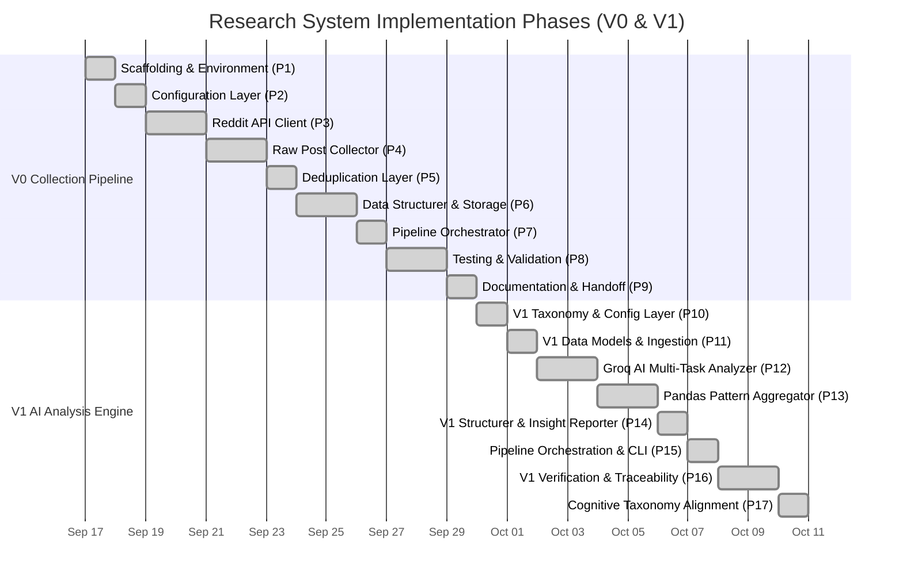
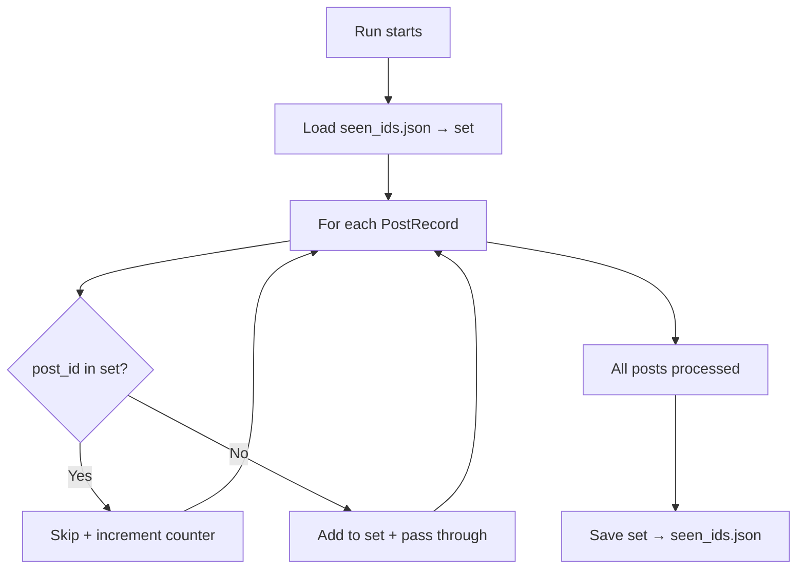
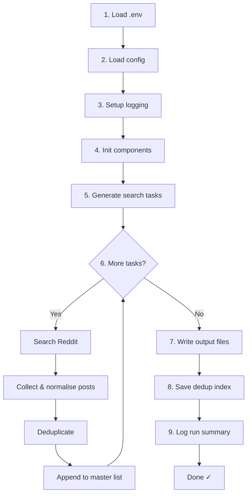

# Implementation Plan — V0 Collection & V1 AI Research Analysis Engine

> **Reference Documents:**
> - [context.md](file:///c:/Users/kumar/Desktop/New%20folder%20(4)/Docs/context.md) — Project context, V0/V1 research layers & scope
> - [architecture.md](file:///c:/Users/kumar/Desktop/New%20folder%20(4)/Docs/architecture.md) — System architecture, component design & traceability
> - [problemstatementv1.txt](file:///c:/Users/kumar/Desktop/New%20folder%20(4)/Docs/problemstatementv1.txt) — V1 Cognitive-system retrieval failure problem statement & memory structure
> - [problemstatementp2.txt](file:///c:/Users/kumar/Desktop/New%20folder%20(4)/Docs/problemstatementp2.txt) — V1 AI-powered research analysis engine specifications

---

## Phase Overview


```mermaid
gantt
    title Research System Implementation Phases (V0 & V1)
    dateFormat  YYYY-MM-DD
    axisFormat  %b %d

    section V0 Collection Pipeline
    Scaffolding & Environment (P1)          :done, p1, 2026-09-17, 1d
    Configuration Layer (P2)                 :done, p2, after p1, 1d
    Reddit API Client (P3)                   :done, p3, after p2, 2d
    Raw Post Collector (P4)                  :done, p4, after p3, 2d
    Deduplication Layer (P5)                 :done, p5, after p4, 1d
    Data Structurer & Storage (P6)           :done, p6, after p5, 2d
    Pipeline Orchestrator (P7)               :done, p7, after p6, 1d
    Testing & Validation (P8)                :done, p8, after p7, 2d
    Documentation & Handoff (P9)             :done, p9, after p8, 1d

    section V1 AI Analysis Engine
    V1 Taxonomy & Config Layer (P10)         :done, p10, after p9, 1d
    V1 Data Models & Ingestion (P11)         :done, p11, after p10, 1d
    Groq AI Multi-Task Analyzer (P12)        :done, p12, after p11, 2d
    Pandas Pattern Aggregator (P13)          :done, p13, after p12, 2d
    V1 Structurer & Insight Reporter (P14)   :done, p14, after p13, 1d
    Pipeline Orchestration & CLI (P15)       :done, p15, after p14, 1d
    V1 Verification & Traceability (P16)     :done, p16, after p15, 2d
    Cognitive Taxonomy Alignment (P17)       :done, p17, after p16, 1d
```

| Phase | Name | Layer | Status | Duration | Dependencies |
| ----- | ---- | ----- | ------ | -------- | ------------ |
| 1 | Project Scaffolding & Environment | V0 | Complete | 1 day | — |
| 2 | Configuration Layer (`queries.yaml`) | V0 | Complete | 1 day | Phase 1 |
| 3 | Reddit API Client (Dual-Mode) | V0 | Complete | 2 days | Phase 2 |
| 4 | Raw Post Collector | V0 | Complete | 2 days | Phase 3 |
| 5 | Deduplication Layer | V0 | Complete | 1 day | Phase 4 |
| 6 | Data Structurer & Storage | V0 | Complete | 2 days | Phase 5 |
| 7 | Pipeline Orchestrator (`main.py`) | V0 | Complete | 1 day | Phases 2–6 |
| 8 | Testing & Validation | V0 | Complete | 2 days | Phase 7 |
| 9 | Documentation & Handoff | V0 | Complete | 1 day | Phase 8 |
| 10 | V1 Research Taxonomy & Config (`taxonomy.yaml`) | V1 | Complete | 1 day | Phase 9 |
| 11 | V1 Data Models & Immutability Loader | V1 | Complete | 1 day | Phase 10 |
| 12 | Groq AI Multi-Task Analysis Engine | V1 | Complete | 2 days | Phase 11 |
| 13 | Pandas Aggregator & Pattern Synthesizer | V1 | Complete | 2 days | Phase 12 |
| 14 | V1 Structurer & Insight Reporter | V1 | Complete | 1 day | Phase 13 |
| 15 | Pipeline Orchestration & CLI Integration | V1 | Complete | 1 day | Phases 10–14 |
| 16 | V1 Testing, Traceability & Validation | V1 | Complete | 2 days | Phase 15 |
| 17 | Cognitive Taxonomy & 5-Stage Breakdown Alignment | V1 | Complete | 1 day | Phase 16 |
| **Total** | | | | **~24 days** | |


---

## Phase 1 — Project Scaffolding & Environment Setup

### Objective
Set up the repository structure, virtual environment, dependencies, and developer tooling so all subsequent phases can build on a stable foundation.

### Tasks

#### 1.1 Create directory structure

```
project-root/
├── config/
├── data/
│   └── output/
├── Docs/
│   ├── problem-statement.txt      (existing)
│   ├── context.md                 (existing)
│   ├── architecture.md            (existing)
│   └── implementation.md          (this document)
├── logs/
├── src/
│   └── __init__.py
├── tests/
├── .env.example
├── .gitignore
├── requirements.txt
└── README.md
```

#### 1.2 Initialize Python environment

```bash
python -m venv .venv
.venv\Scripts\activate          # Windows
pip install --upgrade pip
```

#### 1.3 Create `requirements.txt`

```
praw>=7.7,<8.0
pyyaml>=6.0
python-dotenv>=1.0
groq>=0.11
pytest>=7.0
```

> **Note:** The `groq` SDK is the official Python client for the Groq inference API. V0 installs the dependency and configures the API key; V1 will use it for LLM-powered analysis.

```bash
pip install -r requirements.txt
```

#### 1.4 Create `.gitignore`

```gitignore
# Virtual environment
.venv/

# Credentials
.env

# Output data (large, regenerable)
data/output/
data/seen_ids.json

# Logs
logs/

# Python
__pycache__/
*.pyc
*.pyo
```

#### 1.5 Create `.env.example`

```env
REDDIT_CLIENT_ID=your_client_id_here
REDDIT_CLIENT_SECRET=your_client_secret_here
REDDIT_USER_AGENT=vague-memory-research/0.1
GROQ_API_KEY=your_groq_api_key_here
```

### Exit Criteria

- [x] All directories exist
- [x] Virtual environment activates and all dependencies install without errors
- [x] `.gitignore` excludes credentials and generated data
- [x] Repository initialised with `git init` and first commit

---

## Phase 2 — Configuration Layer

### Objective
Build the YAML-based configuration system so every tuneable parameter is externalised and validated at load time.

### Files to Create

| File                       | Purpose                                |
| -------------------------- | -------------------------------------- |
| `config/queries.yaml`      | All runtime configuration              |
| `src/config_loader.py`     | Loads, validates, and exposes config   |

### Tasks

#### 2.1 Create `config/queries.yaml`

Full configuration file as specified in [architecture.md § 3.1](file:///c:/Users/kumar/Desktop/New%20folder%20(4)/Docs/architecture.md):

```yaml
reddit:
  client_id: "${REDDIT_CLIENT_ID}"
  client_secret: "${REDDIT_CLIENT_SECRET}"
  user_agent: "vague-memory-research/0.1"

search:
  queries:
    - "can't find old photo"
    - "looking for an old screenshot"
    - "remember a photo but can't find it"
    - "can't remember when I took a photo"
    - "lost photo in gallery"
    - "trying to find a picture I took"
  subreddits:
    - "googlephotos"
    - "photography"
    - "AskReddit"
    - "techsupport"
    - "Android"
    - "iphone"
  max_results_per_query: 100
  sort: "relevance"
  time_filter: "all"

storage:
  output_dir: "data/output"
  format: "json"
  dedupe_index: "data/seen_ids.json"

groq:
  api_key: "${GROQ_API_KEY}"
  model: "llama-3.3-70b-versatile"
  enabled: false                     # Set to true in V1; V0 only configures

logging:
  level: "INFO"
  log_file: "logs/run.log"
```

#### 2.2 Implement `src/config_loader.py`

```python
# Responsibilities:
# - Load queries.yaml
# - Substitute ${ENV_VAR} placeholders with os.environ values
# - Detect Reddit access mode: "praw" if client_id & client_secret are provided;
#   otherwise "keyless_rss" (public RSS search feeds)
# - Validate required fields: reddit.user_agent, search.queries (non-empty list)
# - Parse groq config section (api_key, model, enabled)
# - Warn if groq.api_key is missing — V0 doesn't require it
# - Raise ConfigError with descriptive message on validation failure
# - Return a frozen config object (dataclass or namedtuple)
```

**Key design decisions:**

| Decision                        | Rationale                                            |
| ------------------------------- | ---------------------------------------------------- |
| Env-var substitution in loader  | Keeps secrets out of YAML; `.env` loaded via dotenv  |
| Dual Reddit access mode         | Supports Keyless Public RSS without API credentials; activates PRAW if keys exist |
| Fail-fast validation            | Prevents pipeline from running with bad config       |
| Frozen config object            | Prevents accidental mutation during pipeline run     |

#### 2.3 Write `tests/test_config_loader.py`

| Test case                              | Validates                                       |
| -------------------------------------- | ----------------------------------------------- |
| `test_load_valid_config_praw`          | Happy path with PRAW credentials                |
| `test_load_valid_config_keyless`       | Happy path with missing keys -> keyless mode    |
| `test_empty_queries_raises`            | ConfigError when query list is empty             |
| `test_missing_user_agent_raises`       | ConfigError when user_agent is missing          |
| `test_env_var_substitution`            | `${VAR}` placeholders replaced with env values   |
| `test_default_values`                  | Optional fields use sensible defaults            |
| `test_malformed_yaml_raises`           | ConfigError on unparseable YAML                  |
| `test_groq_config_parsed`              | Groq section parsed with api_key, model         |
| `test_missing_groq_key_warns`          | Warning (not error) if GROQ_API_KEY is absent   |

### Exit Criteria

- [x] `config_loader.py` loads and validates `queries.yaml`
- [x] Environment variable substitution works
- [x] Mode detection works (`keyless_rss` vs `praw`)
- [x] Groq config section parsed correctly (with missing-key warning)
- [x] All test cases pass

---

## Phase 3 — Reddit Client (Dual-Mode)

### Objective
Build the client that queries Reddit for posts matching given queries, supporting both Keyless Public RSS mode (default) and authenticated PRAW mode.

### Files to Create

| File                       | Purpose                                |
| -------------------------- | -------------------------------------- |
| `src/reddit_client.py`     | Client supporting Keyless RSS & PRAW   |

### Tasks

#### 3.1 Implement `RedditClient` class
- Supports `search(query, subreddit, sort, limit)`
- If in `keyless_rss` mode: queries `https://www.reddit.com/r/{subreddit}/search.rss?q={query}&restrict_sr=1&sort={sort}`, parses Atom feed XML, extracts clean text, and enforces polite 2-second rate-throttling between queries.
- If in `praw` mode: uses PRAW `subreddit.search(...)`.
- `validate_connection()` verifies connectivity.

    def validate_connection(self) -> bool:
        """
        Verify authentication is working.
        Called once at startup before running any queries.
        """
```

#### 3.2 Error handling details

| Error                    | Response                                                   |
| ------------------------ | ---------------------------------------------------------- |
| `prawcore.OAuthException`| Log error, raise `AuthenticationError`, halt pipeline      |
| `prawcore.RequestException`| Retry up to 3× with exponential backoff (1s, 2s, 4s)    |
| `prawcore.ServerError`   | Retry up to 3× then skip query, log warning               |
| Rate limit (429)         | PRAW auto-handles; log the wait duration                   |

#### 3.3 Write `tests/test_reddit_client.py`

| Test case                              | Validates                                        |
| -------------------------------------- | ------------------------------------------------ |
| `test_successful_auth`                 | Client initialises with valid credentials        |
| `test_invalid_credentials_raises`      | AuthenticationError raised on bad creds          |
| `test_search_returns_submissions`      | Search returns list of Submission-like objects    |
| `test_subreddit_scoped_search`         | Results come from the specified subreddit        |
| `test_global_search_fallback`          | Global search works when subreddit is None       |
| `test_retry_on_network_error`          | Client retries transient errors before failing   |

> **Note:** Tests should use PRAW's `pytest` fixtures or mocked Reddit instances to avoid hitting the live API during CI.

### Exit Criteria

- [x] `RedditClient` authenticates and searches successfully against real Reddit API (manual test with `.env`)
- [x] All 6 unit tests pass with mocked PRAW
- [x] Rate limiting and retry logic verified via mocked transient errors

---

## Phase 4 — Raw Post Collector

### Objective
Extract and normalise fields from raw PRAW submissions into the `PostRecord` data structure, including top-level comments.

### Files to Create

| File                       | Purpose                                        |
| -------------------------- | ---------------------------------------------- |
| `src/models.py`            | `PostRecord` dataclass definition              |
| `src/collector.py`         | Field extraction and normalisation logic        |

### Tasks

#### 4.1 Define `PostRecord` in `src/models.py`

```python
from dataclasses import dataclass, field, asdict
from typing import Optional

@dataclass
class PostRecord:
    post_id: str                       # e.g. "t3_abc123"
    title: str
    selftext: str
    author: str
    subreddit: str
    created_utc: str                   # ISO-8601
    score: int
    num_comments: int
    permalink: str                     # Full URL
    search_query: str
    collected_at: str                  # ISO-8601
    top_comments: list[str] = field(default_factory=list)

    def to_dict(self) -> dict:
        return asdict(self)
```

#### 4.2 Implement `PostCollector` in `src/collector.py`

```python
class PostCollector:
    """Converts raw PRAW Submission objects into PostRecord instances."""

    def __init__(self, max_comments: int = 5):
        """
        Args:
            max_comments: Number of top-level comments to collect per post.
        """

    def collect(self, submission, search_query: str) -> PostRecord | None:
        """
        Extract fields from a single PRAW Submission.
        Returns None if the post is deleted/removed.

        Steps:
        1. Check if submission is deleted/removed → return None
        2. Extract post_id, title, selftext, author (handle [deleted])
        3. Convert created_utc float → ISO-8601 string
        4. Build full permalink URL
        5. Fetch top N top-level comments (replace MoreComments)
        6. Generate collected_at timestamp
        7. Return PostRecord
        """

    def collect_batch(self, submissions, search_query: str) -> list[PostRecord]:
        """
        Process a list of submissions, skipping deleted posts.
        Logs count of skipped posts.
        """
```

#### 4.3 Field mapping reference

| PRAW Attribute          | PostRecord Field     | Transformation                              |
| ----------------------- | -------------------- | ------------------------------------------- |
| `submission.id`         | `post_id`            | Prefix with `"t3_"`                          |
| `submission.title`      | `title`              | Strip whitespace                            |
| `submission.selftext`   | `selftext`           | Strip whitespace; `""` if link post          |
| `submission.author`     | `author`             | `.name` or `"[deleted]"`                     |
| `submission.subreddit`  | `subreddit`          | `.display_name`                             |
| `submission.created_utc`| `created_utc`        | `datetime.utcfromtimestamp().isoformat()+"Z"`|
| `submission.score`      | `score`              | Direct int                                  |
| `submission.num_comments`| `num_comments`      | Direct int                                  |
| `submission.permalink`  | `permalink`          | Prepend `"https://reddit.com"`              |
| *(parameter)*           | `search_query`       | Passed through from caller                  |
| *(generated)*           | `collected_at`       | `datetime.utcnow().isoformat()+"Z"`         |
| `submission.comments`   | `top_comments`       | First N `.body` strings from top-level      |

#### 4.4 Write `tests/test_collector.py`

| Test case                              | Validates                                       |
| -------------------------------------- | ----------------------------------------------- |
| `test_collect_valid_post`              | All fields mapped correctly                     |
| `test_deleted_post_returns_none`       | Deleted submission is skipped                   |
| `test_removed_post_returns_none`       | Removed submission is skipped                   |
| `test_timestamp_iso_format`            | `created_utc` is valid ISO-8601                 |
| `test_permalink_full_url`              | Permalink starts with `https://reddit.com`      |
| `test_top_comments_limit`             | Max N comments collected                        |
| `test_collect_batch_filters_deleted`   | Batch skips deleted, returns rest                |
| `test_author_deleted_fallback`         | Author set to `[deleted]` when None             |

### Exit Criteria

- [x] `PostRecord` dataclass serialises to dict/JSON correctly
- [x] `PostCollector` handles deleted/removed posts gracefully
- [x] Timestamps normalised to ISO-8601 UTC
- [x] All 8 test cases pass

---

## Phase 5 — Deduplication Layer

### Objective
Ensure no Reddit post appears more than once in the output, both within a single run and across multiple runs.

### Files to Create

| File                       | Purpose                                |
| -------------------------- | -------------------------------------- |
| `src/deduplicator.py`      | Duplicate detection and persistence    |

### Tasks

#### 5.1 Implement `Deduplicator` class

```python
class Deduplicator:
    """Filters duplicate PostRecords by post_id using an in-memory set
    backed by a persistent JSON index file."""

    def __init__(self, index_path: str = "data/seen_ids.json"):
        """
        Load existing seen IDs from index_path (if file exists).
        Initialize in-memory set for O(1) lookups.
        """

    def is_duplicate(self, post_id: str) -> bool:
        """Check if post_id has been seen before."""

    def mark_seen(self, post_id: str) -> None:
        """Add post_id to the in-memory set."""

    def filter(self, posts: list[PostRecord]) -> tuple[list[PostRecord], int]:
        """
        Filter a list of PostRecords.
        Returns (unique_posts, duplicate_count).
        Marks all unique posts as seen.
        """

    def save(self) -> None:
        """Persist the current seen_ids set to the index file."""

    def stats(self) -> dict:
        """Return {'total_seen': N, 'duplicates_this_run': M}."""
```

#### 5.2 Persistence strategy


```mermaid
flowchart TD
    START["Run starts"] --> LOAD["Load seen_ids.json → set"]
    LOAD --> PROCESS["For each PostRecord"]
    PROCESS --> CHECK{"post_id in set?"}
    CHECK -- Yes --> SKIP["Skip + increment counter"]
    CHECK -- No --> ADD["Add to set + pass through"]
    SKIP --> PROCESS
    ADD --> PROCESS
    PROCESS --> DONE["All posts processed"]
    DONE --> SAVE["Save set → seen_ids.json"]
```

- **File format:** `seen_ids.json` — a JSON array of string IDs
- **Initial state:** If file doesn't exist, start with empty set
- **Save timing:** After all queries have been processed (in `main.py`)

#### 5.3 Write `tests/test_deduplicator.py`

| Test case                              | Validates                                        |
| -------------------------------------- | ------------------------------------------------ |
| `test_new_post_passes_through`         | Unseen post_id is not flagged as duplicate       |
| `test_duplicate_post_filtered`         | Same post_id in same batch → filtered            |
| `test_cross_batch_dedup`               | post_id from batch 1 is filtered in batch 2      |
| `test_persistence_load`               | IDs from previous run's file are loaded           |
| `test_persistence_save`               | Current set is saved to file correctly            |
| `test_empty_file_starts_fresh`         | Missing index file → empty set, no error         |
| `test_filter_returns_correct_counts`   | `(unique_list, dup_count)` are accurate           |

### Exit Criteria

- [x] Deduplication works within a single run (same batch)
- [x] Deduplication works across multiple runs (persistent index)
- [x] `seen_ids.json` is correctly loaded and saved
- [x] All 7 test cases pass

---

## Phase 6 — Data Structurer & Storage Layer

### Objective
Serialise the deduplicated post records into JSON and CSV output files with metadata headers.

### Files to Create

| File                       | Purpose                                |
| -------------------------- | -------------------------------------- |
| `src/structurer.py`        | Output serialisation (JSON + CSV)      |

### Tasks

#### 6.1 Implement `DataStructurer` class

```python
class DataStructurer:
    """Serialises PostRecord lists into JSON and/or CSV files."""

    def __init__(self, output_dir: str, output_format: str = "json"):
        """
        Args:
            output_dir: Directory to write output files to.
            output_format: "json", "csv", or "both".
        """

    def write(self, posts: list[PostRecord], metadata: dict) -> dict:
        """
        Write all posts to the configured format(s).

        Args:
            posts: List of deduplicated PostRecords.
            metadata: Run metadata (generated_at, total_posts,
                      queries_used, duplicates_skipped).

        Returns:
            dict with keys 'files_written' (list of paths)
                 and 'total_records' (int).
        """

    def _write_json(self, posts, metadata) -> str:
        """Write data/output/reddit_evidence.json with metadata header."""

    def _write_csv(self, posts) -> str:
        """Write data/output/reddit_evidence.csv (flat, zero text truncation)."""
```

#### 6.2 JSON output schema

```json
{
  "metadata": {
    "generated_at": "<ISO-8601>",
    "total_records": 312,
    "queries_executed": 6,
    "duplicates_skipped": 47
  },
  "records": [ ... ]
}
```

#### 6.3 CSV output schema

| Column                 | Source                               | Notes                           |
| ---------------------- | ------------------------------------ | ------------------------------- |
| `record_id`            | `EvidenceRecord.record_id`           | Stable research ID (RD_xxxxxx)  |
| `title`                | `EvidenceRecord.title`               | Escaped for CSV                 |
| `raw_text`             | `EvidenceRecord.raw_text`            | Full untruncated raw text       |
| `cleaned_text`         | `EvidenceRecord.cleaned_text`        | Full normalized text            |
| `author`               | `EvidenceRecord.author`              | Pseudonym or username           |
| `subreddit`            | `EvidenceRecord.subreddit`           |                                 |
| `created_at`           | `EvidenceRecord.created_at`          | ISO-8601 UTC                    |
| `score`                | `EvidenceRecord.score`               |                                 |
| `num_comments`         | `EvidenceRecord.num_comments`        |                                 |
| `url`                  | `EvidenceRecord.url`                 | Full permalink                  |
| `queries_matched`      | `EvidenceRecord.queries_matched`     | Canonical list, joined with ";" |
| `query_used`           | `EvidenceRecord.query_used`          | Backward compatibility string   |
| `retrieved_at`         | `EvidenceRecord.retrieved_at`        | ISO-8601 UTC                    |
| `top_comments`         | `EvidenceRecord.top_comments`        | Joined with `" ||| "` separator |
| `ai_relevance`         | `EvidenceRecord.ai_relevance`        | Null in V0                      |
| `relevance_confidence` | `EvidenceRecord.relevance_confidence`| Null in V0                      |
| `evidence_status`      | `EvidenceRecord.evidence_status`     | Null in V0                      |

#### 6.4 Write `tests/test_structurer.py`

| Test case                              | Validates                                           |
| -------------------------------------- | --------------------------------------------------- |
| `test_write_json_creates_file`         | `reddit_evidence.json` exists after write           |
| `test_json_has_metadata_header`        | Metadata fields present and correct                 |
| `test_json_posts_match_input`          | All input records serialised correctly              |
| `test_write_csv_creates_file`          | `reddit_evidence.csv` exists after write            |
| `test_csv_headers_match_schema`        | CSV column headers match expected schema            |
| `test_csv_row_count_matches`           | Number of CSV rows matches number of posts          |
| `test_write_both_formats`              | Both JSON and CSV files created                     |
| `test_output_dir_created_if_missing`   | Output directory auto-created                       |
| `test_empty_posts_produces_valid_output`| Zero posts → valid JSON/CSV with empty array       |

### Exit Criteria

- [x] JSON output matches the schema from architecture.md
- [x] CSV output is importable by pandas / Excel
- [x] Metadata header accurately reflects run statistics
- [x] Output directory is auto-created if missing
- [x] All 9 test cases pass

---

## Phase 6.5 — Groq Client Preparation

### Objective
Prepare the Groq LLM client module so that V1 analysis modules can import and use it immediately. V0 does **not** make any Groq API calls — it only installs the dependency, configures the API key, and provides a ready-to-use client wrapper.

### Files to Create

| File                       | Purpose                                        |
| -------------------------- | ---------------------------------------------- |
| `src/groq_client.py`       | Groq API client wrapper using official SDK     |
| `tests/test_groq_client.py`| Unit tests for Groq client initialisation      |

### Tasks

#### 6.5.1 Implement `GroqClient` in `src/groq_client.py`

```python
from groq import Groq
import logging

logger = logging.getLogger(__name__)


class GroqClient:
    """Wrapper around the Groq inference API using the official SDK.
    
    V0: Initialises the client and validates the API key.
    V1: Will expose methods for post analysis, classification, and
        pattern extraction.
    """

    def __init__(self, api_key: str,
                 model: str = "llama-3.3-70b-versatile"):
        """
        Args:
            api_key: Groq API key (from GROQ_API_KEY env var).
            model: Model identifier (e.g. llama-3.3-70b-versatile,
                   mixtral-8x7b-32768, gemma2-9b-it).
        """
        self.model = model
        self.client = Groq(api_key=api_key)
        logger.info(f"GroqClient initialised (model={model})")

    def health_check(self) -> bool:
        """
        Verify the API key is valid by listing available models.
        Returns True if the key is valid, False otherwise.
        """

    # --- V1 methods (stubs) ---

    def analyze_post(self, post: dict) -> dict:
        """V1: Analyze a single post for memory patterns. Not implemented in V0."""
        raise NotImplementedError("Groq analysis is a V1 feature.")

    def classify_memory_type(self, post: dict) -> str:
        """V1: Classify what type of memory the user is searching for. Not implemented in V0."""
        raise NotImplementedError("Groq classification is a V1 feature.")

    def extract_search_behavior(self, post: dict) -> dict:
        """V1: Extract search-behavior signals from a post. Not implemented in V0."""
        raise NotImplementedError("Groq behavior extraction is a V1 feature.")
```

#### 6.5.2 Write `tests/test_groq_client.py`

| Test case                              | Validates                                       |
| -------------------------------------- | ----------------------------------------------- |
| `test_init_with_valid_key`             | Client initialises without error                |
| `test_init_sets_model`                 | `self.model` matches provided model             |
| `test_v1_stubs_raise_not_implemented`  | `analyze_post` etc. raise `NotImplementedError` |
| `test_health_check_with_mock`          | Health check calls API and returns bool          |

### Exit Criteria

- [x] `GroqClient` initialises with Groq API key
- [x] V1 method stubs are defined and raise `NotImplementedError`
- [x] Health check validates API connectivity
- [x] All 4 test cases pass

---

## Phase 7 — Pipeline Orchestrator (`main.py`)

### Objective
Wire all components together into a single runnable pipeline in `src/main.py`.

### Files to Create

| File                       | Purpose                                |
| -------------------------- | -------------------------------------- |
| `src/main.py`              | Entry point — orchestrates the full pipeline |
| `src/query_engine.py`      | Generates search tasks from config     |
| `src/logger_setup.py`      | Configures Python logging              |

### Tasks

#### 7.1 Implement `QueryEngine` in `src/query_engine.py`

```python
class QueryEngine:
    """Generates search task tuples from configuration."""

    def __init__(self, config: AppConfig):
        """Store config for query generation."""

    def generate_tasks(self) -> list[tuple[str, str | None, dict]]:
        """
        Generate Cartesian product of queries × subreddits.
        If no subreddits specified, yield (query, None, params).

        Returns list of (query_string, subreddit_name, search_params).
        """
```

#### 7.2 Implement `src/logger_setup.py`

```python
def setup_logging(log_level: str, log_file: str) -> logging.Logger:
    """
    Configure root logger with:
    - Console handler (INFO level)
    - File handler (configurable level, append mode)
    - Format: "%(asctime)s %(levelname)-5s %(message)s"

    Creates log directory if it doesn't exist.
    Returns the configured logger.
    """
```

#### 7.3 Implement `src/main.py`

```python
def main():
    """
    Full pipeline orchestration:

    1. Load .env file (python-dotenv)
    2. Load and validate config (config_loader)
    3. Set up logging (logger_setup)
    4. Log run start
    5. Initialize components:
       - QueryEngine(config)
       - RedditClient(config)
       - PostCollector(max_comments=5)
       - Deduplicator(config.storage.dedupe_index)
       - DataStructurer(config.storage.output_dir, config.storage.format)
       - GroqClient(config.groq) [optional — only if groq.enabled]
    6. If groq.enabled, run GroqClient.health_check() and log status
    7. Generate search tasks
    8. For each task (query, subreddit, params):
       a. Log: "Searching for '{query}' in r/{subreddit}..."
       b. Call RedditClient.search(...)
       c. Call PostCollector.collect_batch(...)
       d. Call Deduplicator.filter(...)
       e. Append unique posts to master list
       f. Log: "{N} posts collected, {M} duplicates skipped"
    9. Call DataStructurer.write(all_posts, metadata)
    10. Call Deduplicator.save()
    11. Log run summary: total posts, duplicates, files written
    """

if __name__ == "__main__":
    main()
```

#### 7.4 Pipeline flow diagram


```mermaid
flowchart TD
    A["1. Load .env"] --> B["2. Load config"]
    B --> C["3. Setup logging"]
    C --> D["4. Init components"]
    D --> E["5. Generate search tasks"]
    E --> F{"6. More tasks?"}
    F -- Yes --> G["Search Reddit"]
    G --> H["Collect & normalise posts"]
    H --> I["Deduplicate"]
    I --> J["Append to master list"]
    J --> F
    F -- No --> K["7. Write output files"]
    K --> L["8. Save dedup index"]
    L --> M["9. Log run summary"]
    M --> N["Done ✓"]
```

### Exit Criteria

- [x] `python src/main.py` runs the full pipeline end-to-end
- [x] Pipeline halts gracefully on auth errors (before any queries)
- [x] Pipeline continues past individual query failures (logs warning, moves on)
- [x] Run summary logged with correct totals
- [x] Output files written to `data/output/`

---

## Phase 8 — Testing & Validation

### Objective
Run all tests, perform integration testing against the live Reddit API, and validate output correctness.

### Tasks

#### 8.1 Run full unit test suite

```bash
pytest tests/ -v --tb=short
```

**Expected test matrix:**

| Test file                       | Tests | Phase |
| ------------------------------- | ----- | ----- |
| `tests/test_config_loader.py`   | 8     | 2     |
| `tests/test_reddit_client.py`   | 6     | 3     |
| `tests/test_collector.py`       | 8     | 4     |
| `tests/test_deduplicator.py`    | 7     | 5     |
| `tests/test_structurer.py`      | 9     | 6     |
| `tests/test_grok_client.py`     | 4     | 6.5   |
| **Total**                       | **42**|       |

#### 8.2 Integration test — small-scale live run

Run the full pipeline with a reduced configuration:

```yaml
# config/queries_test.yaml
search:
  queries:
    - "can't find old photo"
    - "looking for an old screenshot"
  subreddits:
    - "googlephotos"
  max_results_per_query: 10
```

```bash
python src/main.py --config config/queries_test.yaml
```

**Validation checklist:**

| Check                                    | How to verify                                                    |
| ---------------------------------------- | ---------------------------------------------------------------- |
| Output file exists                       | `ls data/output/reddit_evidence.json`                            |
| JSON schema correct                      | `python -c "import json; json.load(open('data/output/reddit_evidence.json'))"`|
| All fields populated                     | Inspect first 3 records manually                                 |
| Permalinks resolve                       | Open 3 random permalinks in browser                              |
| No duplicate source_ids                  | `jq '[.records[].source_id] | unique | length' reddit_evidence.json` |
| Timestamps are valid ISO-8601            | Spot-check 3 records                                             |
| Metadata totals match                    | `metadata.total_records` == `len(records)`                       |

#### 8.3 Deduplication cross-run test

1. Run pipeline with test config → produces N posts
2. Run pipeline again with same config
3. Verify: second run produces 0 new posts, all N are skipped as duplicates
4. Verify: `seen_ids.json` contains exactly N IDs

#### 8.4 Edge case testing

| Scenario                      | How to test                                                |
| ----------------------------- | ---------------------------------------------------------- |
| Empty search results          | Query with nonsensical string, verify empty output         |
| Deleted/removed posts         | Verify they're skipped in logs                             |
| Network interruption          | Disconnect WiFi mid-run, verify retry + graceful skip      |
| Very long post body           | Verify JSON handles large selftext without truncation      |
| Unicode in post content       | Verify emoji / non-ASCII characters preserved correctly    |

### Exit Criteria

- [x] All unit tests pass (55/55 passed)
- [x] Integration test produces valid, non-empty output
- [x] Cross-run deduplication verified
- [x] Edge cases handled gracefully
- [x] No unhandled exceptions in any test scenario

---

## Phase 9 — Documentation & Handoff

### Objective
Finalise all documentation so the project is self-explanatory and ready for V1 development.

### Tasks

#### 9.1 Write `README.md`

```markdown
# Vague-Memory Research — V0 Reddit Data Collector

## Quick Start
1. Clone the repo
2. Copy `.env.example` → `.env` and fill in Reddit credentials + Groq API key
3. `pip install -r requirements.txt`
4. `python src/main.py`

## Configuration
Edit `config/queries.yaml` to customise search queries, subreddits, and output settings.

### Groq — V1 Preparation
The Groq API key (`GROQ_API_KEY`) is configured in `.env`. The Groq client is
installed and ready for V1 analysis modules. Set `groq.enabled: true` in
`queries.yaml` to activate the Groq health check.

## Output
- `data/output/reddit_evidence.json` — Structured dataset with metadata
- `data/output/reddit_evidence.csv` — Flat export for spreadsheets

## Tests
pytest tests/ -v
```

#### 9.2 Add inline docstrings

Ensure every module, class, and public method has a docstring explaining:
- What it does
- What it accepts
- What it returns
- What errors it raises

#### 9.3 Update `Docs/` folder

| Document                    | Action                                          |
| --------------------------- | ----------------------------------------------- |
| `problem-statement.txt`     | No change (original requirement)                |
| `context.md`                | No change                                       |
| `architecture.md`           | Update if any architecture deviations occurred  |
| `implementation.md`         | Mark all phases as complete                     |

#### 9.4 Final review checklist

- [x] All code follows PEP 8 style
- [x] No hardcoded credentials anywhere in source
- [x] `.env` is in `.gitignore`
- [x] All tests pass
- [x] README has clear setup instructions
- [x] Output schema documented
- [x] Run logs provide enough information for debugging


### Exit Criteria

- [x] README is complete and accurate
- [x] All public APIs documented
- [x] Project is ready for handoff to V1 development

---

## Phase 10 — V1 Research Taxonomy & Configuration Layer

### Objective
Externalize the research taxonomy into `config/taxonomy.yaml` and extend `src/config_loader.py` so research categories (memory cues, failure points, target media, workarounds, friction types) can evolve without touching code.

### Files to Create / Modify

| File | Purpose |
| ---- | ------- |
| `config/taxonomy.yaml` | Declares all V1 classification rubrics and research categories |
| `src/config_loader.py` | Extended to load, parse, and validate `taxonomy.yaml` |
| `tests/test_taxonomy_config.py` | Unit tests for taxonomy validation and fallback parsing |

### Tasks

#### 10.1 Create `config/taxonomy.yaml`
Declare:
- `relevance_criteria`: Tri-state classification rubric (`relevant`, `possibly_relevant`, `irrelevant`) to distinguish genuine vague-memory retrieval difficulties from irrelevant complaints (e.g., app crashes, sync/backup errors, billing).
- `memory_cues`: Cognitive structure of human visual memory cues:
  - `person`: People, faces, or groups depicted in the photo.
  - `place_location`: Geographic places, landmarks, rooms, or travel spots (e.g., Goa, beach, restaurant, college, home).
  - `event_occasion`: Occasions (e.g., vacation trip, birthday, wedding, concert, college event).
  - `temporal_epoch`: Approximate year, season, life stage (e.g., last year, during college, around Diwali, sometime in 2022).
  - `object`: Physical items, cars, clothes, pets, food, devices, medicine.
  - `visual_details`: Perceptual features (e.g., red shirt, sunset, blue building, group photo, night lighting).
  - `text_in_image`: Text remembered from visible images (e.g., signboard, receipt, document, medicine name, restaurant name).
  - `activity_action`: Actions / verbs (e.g., eating, travelling, studying, attending an event).
  - `relationship`: Social bonds and interpersonal ties (e.g., "my friend", "my mother", "old roommate").
  - `ambient_context`: Weather, mood, emotional state, background atmosphere.
- `retrieval_failure_stages`: The 5-stage cognitive-system failure breakdown mapping where retrieval breaks:
  - `memory_to_query`: Can users translate their memory into a searchable representation? (User remembers photo details but cannot verbalize into searchable keywords).
  - `query_to_system`: Does the system understand the user's natural description? (User provides natural description, system misinterprets intent).
  - `system_to_candidate`: Can the system narrow the search space effectively? (System returns too many unrelated images or zero results).
  - `candidate_to_recognition`: Does the result presentation help users identify the remembered item? (Flat gallery overload, visual fatigue).
  - `search_refinement`: Can users iteratively steer retrieval when the initial attempt fails? (Lack of feedback controls or guidance to refine search).
- `retrieval_failure_points`: Granular breakdown points (`vocabulary_mismatch`, `temporal_fuzziness`, `missing_metadata`, `visual_semantic_gap`, `screenshot_clutter`, `volume_overload`).
- `target_media_types`: Media classes (`personal_photo`, `screenshot`, `video_clip`, `document_receipt`, `meme_saved_image`, `scanned_physical_photo`).
- `workaround_types`: Coping behaviors (`endless_scrolling`, `external_social_backup`, `peer_inquiry`, `reverse_image_search`, `keyword_guessing`, `abandonment`).
- `friction_types`: Emotional and cognitive friction (`time_wasted`, `frustration_with_search_tool`, `fear_of_memory_loss`, `cognitive_overload`, `device_storage_anxiety`).
- `groq_analysis`: Default model (`llama-3.3-70b-versatile`), temperature (0.1), and retry limits.

#### 10.2 Implement Taxonomy Loader in `src/config_loader.py`
- Add `load_taxonomy(path: str = "config/taxonomy.yaml") -> TaxonomyConfig`.
- Validate required sections and unique category IDs.
- Expose helper methods to validate or normalize raw category strings against taxonomy IDs.

#### 10.3 Write `tests/test_taxonomy_config.py`
- Test valid taxonomy loading.
- Test missing required sections raises `ConfigError`.
- Test category lookup and normalization.

### Exit Criteria
- [x] `taxonomy.yaml` created with all research categories.
- [x] `config_loader.py` parses and validates taxonomy correctly.
- [x] All taxonomy unit tests pass.

---

## Phase 11 — V1 Data Models & Immutability Ingestion

### Objective
Define the V1 analysis data models and build the read-only evidence loader that guarantees the original V0 dataset (`reddit_evidence.json`) is never modified while maintaining strict `record_id` traceability.

### Files to Create / Modify

| File | Purpose |
| ---- | ------- |
| `src/models.py` | Define `AnalyzedEvidenceRecord` schema |
| `src/evidence_loader.py` | Read-only ingestion of V0 dataset with integrity validation |
| `tests/test_evidence_loader.py` | Ingestion, validation, and immutability tests |

### Tasks

#### 11.1 Define `AnalyzedEvidenceRecord` in `src/models.py`
```python
@dataclass
class AnalyzedEvidenceRecord:
    record_id: str                      # Retains exact V0 record_id (e.g. RD_000001)
    source_id: str                      # Reddit submission ID (e.g. t3_abc123)
    title: str
    raw_text: str
    url: str
    author: str
    subreddit: str
    created_at: str
    retrieved_at: str
    queries_matched: list[str]
    is_relevant: bool
    relevance_classification: str       # "relevant" | "possibly_relevant" | "irrelevant"
    relevance_confidence: float
    relevance_reasoning: str
    target_media: str
    memory_cues_present: list[str]      # e.g., ["person", "place_location", "relationship"]
    memory_cue_details: dict[str, str]  # Keyed by cue category
    retrieval_failure_stage: str        # e.g., "memory_to_query", "query_to_system", etc.
    retrieval_failure_point: str        # Granular rubric ID from taxonomy
    failure_evidence: str
    workarounds_used: list[str]
    friction_experienced: list[str]
    desired_outcome: str
    analyzed_at: str
    model_used: str

    def to_dict(self) -> dict:
        ...
```

#### 11.2 Implement `src/evidence_loader.py`
- `load_v0_evidence(filepath: str) -> list[EvidenceRecord]`
- Verify file exists and contains valid `records` with `record_id`.
- Compute and verify file hash before and after analysis to ensure 100% immutability.
- Handle missing files with clear errors indicating V0 collection must be run first.

#### 11.3 Write `tests/test_evidence_loader.py`
- Test ingestion of canonical V0 JSON.
- Test missing `record_id` detection.
- Verify read-only guarantees.

### Exit Criteria
- [x] `AnalyzedEvidenceRecord` defined and serializable to dict/JSON.
- [x] `evidence_loader.py` loads V0 records and validates integrity.
- [x] Tests pass.

---

## Phase 12 — Groq AI Multi-Task Analysis Engine

### Objective
Implement the AI prompt orchestrator that sends evidence to Groq (`llama-3.3-70b-versatile`) and receives structured, validated research classifications conforming to `taxonomy.yaml`.

### Files to Create / Modify

| File | Purpose |
| ---- | ------- |
| `src/analyzer.py` | Multi-task LLM analysis engine |
| `src/groq_client.py` | Extended with retry backoff, chat completions, and rate limiting |
| `tests/test_analyzer.py` | Prompt construction and JSON parsing unit tests |

### Tasks

#### 12.1 Implement `GroqClient.complete_chat()` in `src/groq_client.py`
- Call `client.chat.completions.create()`.
- Add retry logic with exponential backoff on 429 (rate limits) and 5xx errors.
- Enforce JSON response mode (`response_format={"type": "json_object"}`).

#### 12.2 Implement `AIAnalyzer` in `src/analyzer.py`
- Build multi-task system and user prompts injecting `taxonomy.yaml` categories, the 5 cognitive failure stages, tri-state relevance rubrics, and evidence text.
- Parse JSON response:
  - Extract tri-state relevance classification (`relevant`, `possibly_relevant`, `irrelevant`), confidence, and reasoning (filtering out unrelated crash/backup complaints).
  - Extract cognitive visual memory cues present (`person`, `place_location`, `event_occasion`, `temporal_epoch`, `object`, `visual_details`, `text_in_image`, `activity_action`, `relationship`, `ambient_context`) and specific quoted memory details.
  - Classify retrieval failure across the 5 breakdown stages (`memory_to_query`, `query_to_system`, `system_to_candidate`, `candidate_to_recognition`, `search_refinement`) and assign the primary granular failure point.
  - Extract target media, workarounds used, friction experienced, and desired outcome.
- Validate that extracted categories exist in taxonomy; map synonyms or fallback to `other`.
- Attach original `record_id` and construct `AnalyzedEvidenceRecord`.

#### 12.3 Write `tests/test_analyzer.py`
- Mock Groq API calls returning realistic JSON payloads.
- Test prompt assembly.
- Test JSON parsing with markdown code fences (` ```json `).
- Test recovery from missing fields or malformed JSON.

### Exit Criteria
- [x] `AIAnalyzer` correctly extracts all 8 research dimensions.
- [x] Resilience against API rate limits and transient network errors.
- [x] All analyzer unit tests pass.

---

## Phase 13 — Statistical Aggregation & Pattern Engine (Pandas)

### Objective
Build `src/aggregator.py` using Pandas to compute quantitative distributions, cross-tabulations, and recurring problem patterns across users.

### Files to Create / Modify

| File | Purpose |
| ---- | ------- |
| `src/aggregator.py` | Pandas-based research statistics and pattern synthesizer |
| `tests/test_aggregator.py` | Aggregation, cross-tabulation, and pattern grouping tests |

### Tasks

#### 13.1 Implement `PatternAggregator` in `src/aggregator.py`
- Convert list of `AnalyzedEvidenceRecord` dicts to a pandas `DataFrame`.
- Compute overall tri-state relevance distribution (`relevant`, `possibly_relevant`, `irrelevant`).
- Filter for relevant records (`is_relevant == True` or `relevance_classification in ["relevant", "possibly_relevant"]`).
- Compute univariate frequency counts:
  - Retrieval failure stages breakdown across the 5 cognitive stages (`memory_to_query`, `query_to_system`, `system_to_candidate`, `candidate_to_recognition`, `search_refinement`)
  - Top memory cues (exploding list of cues, including `relationship`, `place_location`, etc.)
  - Primary retrieval failure points
  - Common workarounds
  - Target media distribution
  - Friction breakdown
- Compute bivariate cross-tabulations:
  - `retrieval_failure_stage` vs. `retrieval_failure_point`
  - `memory_cues` vs. `retrieval_failure_stage`
  - `memory_cues` vs. `retrieval_failure_point`
  - `target_media` vs. `workaround`
- Synthesize Recurring Problem Patterns:
  - Cluster co-occurring failure stages, memory cue types, and failure points.
  - Calculate pattern prevalence (count and % of relevant evidence).
  - Collect supporting evidence citations (`record_id`, URL, quote).

#### 13.2 Write `tests/test_aggregator.py`
- Test with deterministic mock analyzed records.
- Verify frequency counts and percentage totals.
- Verify evidence citations in recurring patterns.

### Exit Criteria
- [x] Aggregator produces correct distribution summaries and cross-tabs.
- [x] Recurring patterns contain valid `record_id` citations.
- [x] Tests pass.

---

## Phase 14 — V1 Serialization & Reporting Layer

### Objective
Implement `src/insight_reporter.py` to serialize analyzed records to `analyzed_evidence.json` and `analyzed_evidence.csv`, and compile the final `insight_report.json`.

### Files to Create / Modify

| File | Purpose |
| ---- | ------- |
| `src/insight_reporter.py` | Serializes V1 outputs and formats insight report |
| `tests/test_insight_reporter.py` | Schema validation and file writing tests |

### Tasks

#### 14.1 Implement `InsightReporter` in `src/insight_reporter.py`
- `write_analyzed_evidence(records, output_dir)`: Writes `analyzed_evidence.json` (nested with `relevance_classification`, `retrieval_failure_stage`, `relationship` cues) and `analyzed_evidence.csv` (flat view with zero text truncation).
- `write_insight_report(aggregations, patterns, metadata, output_dir)`: Formats and writes `insight_report.json` with executive summary, central research question context, 5-stage cognitive failure breakdown, tri-state relevance distributions, and recurring patterns with direct user quotes and permalink citations.

#### 14.2 Write `tests/test_insight_reporter.py`
- Validate JSON schema conformance for `analyzed_evidence.json` and `insight_report.json`.
- Verify CSV column headers and row count.
- Verify directory auto-creation if missing.

### Exit Criteria
- [x] `analyzed_evidence.json` and `.csv` generated with full V0 + V1 data.
- [x] `insight_report.json` generated with clear findings and citations.
- [x] Tests pass.

---

## Phase 15 — Pipeline Orchestration & CLI Integration

### Objective
Update `src/main.py` to support running V0 collection, V1 analysis, or both end-to-end via CLI arguments (`--mode collect|analyze|both`, `--sample N`, `--dry-run`).

### Files to Create / Modify

| File | Purpose |
| ---- | ------- |
| `src/main.py` | CLI entry point supporting both V0 collection and V1 analysis |
| `tests/test_main_cli.py` | CLI argument parsing and mode execution tests |

### Tasks

#### 15.1 Add CLI Arguments to `src/main.py`
- `--mode`: Choice of `collect` (default V0), `analyze` (V1), or `both`.
- `--config`: Path to queries config (default: `config/queries.yaml`).
- `--taxonomy`: Path to taxonomy config (default: `config/taxonomy.yaml`).
- `--input`: Path to V0 evidence for analysis (default: `data/output/reddit_evidence.json`).
- `--sample`: Limit analysis to first N records for rapid validation.
- `--dry-run`: Validate configs and connections without writing files.

#### 15.2 Wire V1 Pipeline Execution
1. Check `GROQ_API_KEY` and run `GroqClient.health_check()`.
2. Ingest `reddit_evidence.json` via `EvidenceLoader`.
3. Iterate and analyze records via `AIAnalyzer` with progress logging.
4. Run `PatternAggregator` to compute metrics and detect patterns.
5. Export results via `InsightReporter`.
6. Log completion summary.

#### 15.3 Write `tests/test_main_cli.py`
- Test CLI arg parsing for all modes.
- Test dry-run execution.

### Exit Criteria
- [x] `python src/main.py --mode analyze` runs V1 pipeline smoothly.
- [x] CLI flags work as expected.
- [x] Tests pass.

---

## Phase 16 — V1 Verification, Traceability & Validation

### Objective
Validate end-to-end functionality, verify that the traceability chain is unbroken, and ensure complete V0 source data immutability.

### Tasks

#### 16.1 Run Full Test Suite
```bash
pytest tests/ -v
```

#### 16.2 Implement `tests/test_traceability.py`
- Verifies that every `record_id` in `insight_report.json` cites a valid record in `analyzed_evidence.json`.
- Verifies that every record in `analyzed_evidence.json` matches a record in `reddit_evidence.json` with an active Reddit URL.
- Computes SHA-256 of `reddit_evidence.json` before and after analysis to prove zero mutation.
- Verifies that all analyzed records adhere to the 5-stage retrieval failure taxonomy and tri-state relevance rubric.

#### 16.3 Small-Scale Live Validation
```bash
python src/main.py --mode analyze --sample 5
```
- Inspect `data/output/analyzed_evidence.json` and `data/output/insight_report.json`.
- Manually review 3 analyzed records against their source Reddit threads.

### Exit Criteria
- [x] All unit and integration tests pass.
- [x] Traceability chain verified end-to-end.
- [x] Zero mutation of V0 files verified.
- [x] Sample run completes without errors.

---

## Phase 17 — Cognitive Taxonomy & 5-Stage Breakdown Alignment

### Objective
Incorporate the V1 cognitive-system retrieval failure breakdown framework (`problemstatementv1.txt`), tri-state relevance criteria, and the human visual memory structure (including relationship cues) across the codebase and test suites.

### Tasks

#### 17.1 Taxonomy Layer Updates (`config/taxonomy.yaml` & `src/config_loader.py`)
- [x] Declare `relevance_classes` (`relevant`, `possibly_relevant`, `irrelevant`) with non-retrieval filtering.
- [x] Add `relationship` memory cue category (*"my friend"*, *"my mother"*, *"old roommate"*).
- [x] Declare `retrieval_failure_stages` (`memory_to_query`, `query_to_system`, `system_to_candidate`, `candidate_to_recognition`, `search_refinement`).
- [x] Extend `TaxonomyConfig` and `load_taxonomy()` to validate and query failure stages and relevance classes.

#### 17.2 Data Models Updates (`src/models.py`)
- [x] Add `relevance_classification` and `retrieval_failure_stage` to `AnalyzedEvidenceRecord`.
- [x] Update `to_dict()`, `from_dict()`, and `from_evidence_record()` with full backwards compatibility.

#### 17.3 AI Analyzer Updates (`src/analyzer.py`)
- [x] Update LLM prompt to instruct Groq LLaMA-3.3-70B on tri-state relevance and the 5 cognitive breakdown stages.
- [x] Update JSON validation to normalize `relevance_classification` and `retrieval_failure_stage`.

#### 17.4 Aggregation & Reporting Updates (`src/aggregator.py` & `src/insight_reporter.py`)
- [x] Add `compute_relevance_distribution()` and `compute_failure_stage_distribution()` in `PatternAggregator`.
- [x] Add cross-tabulations for `failure_stages_vs_failure_points` and `memory_cues_vs_failure_stages`.
- [x] Include failure stages and tri-state relevance in `insight_report.json` and `analyzed_evidence.csv` headers.

#### 17.5 Testing & Invariant Verification
- [x] Update and expand unit tests across `tests/test_taxonomy_config.py`, `tests/test_analyzer.py`, `tests/test_aggregator.py`, `tests/test_insight_reporter.py`, and `tests/test_traceability.py`.
- [x] Run full test suite (`pytest tests/`) $\rightarrow$ 129/129 passed.

### Exit Criteria
- [x] All 5 failure stages and tri-state relevance criteria active in codebase.
- [x] All 129 unit and integration tests passing.
- [x] Traceability invariants and zero-mutation guarantees preserved.

---

## Risk Register

| Risk | Layer | Likelihood | Impact | Mitigation |
| ---- | ----- | ---------- | ------ | ---------- |
| Reddit API rate limits throttle collection | V0 | Medium | Low | PRAW auto-handles; polite 2s delays in RSS mode |
| Reddit credentials rejected | V0 | Low | High | Keyless RSS fallback enabled by default |
| Groq API rate limits (TPM / RPM) | V1 | Medium | Medium | Exponential backoff retry in GroqClient; configurable batching |
| Groq API key missing or invalid | V1 | Low | High | Health check at pipeline startup fails fast with clear message |
| LLM returns malformed JSON | V1 | Medium | Low | JSON mode enabled; regex recovery and fallback schema repair |
| Model hallucinates non-taxonomy categories | V1 | Medium | Low | Strict system prompt; post-parsing validation coerces to taxonomy or `other` |
| V0 source evidence mutated during V1 | V1 | Low | High | Read-only file permissions; SHA-256 hash check before/after analysis |
| Large dataset causes slow analysis | V1 | Low | Medium | High throughput Groq LPU inference; `--sample` flag for fast iterations |
| Seen IDs index corrupted | V0 | Low | Medium | Validate JSON on load; atomic write with backup |

---

## Appendix A — File → Phase Mapping

| File | Created In | Modified In | Layer |
| ---- | ---------- | ----------- | ----- |
| `config/queries.yaml` | Phase 2 | — | V0 |
| `config/taxonomy.yaml` | Phase 10 | Phase 17 | V1 |
| `src/__init__.py` | Phase 1 | — | Core |
| `src/config_loader.py` | Phase 2 | Phase 10, 17 | V0 + V1 |
| `src/reddit_client.py` | Phase 3 | — | V0 |
| `src/models.py` | Phase 4 | Phase 11, 17 | V0 + V1 |
| `src/collector.py` | Phase 4 | — | V0 |
| `src/cleaner.py` | Phase 4 | — | V0 |
| `src/deduplicator.py` | Phase 5 | — | V0 |
| `src/structurer.py` | Phase 6 | — | V0 |
| `src/reporter.py` | Phase 6 | — | V0 |
| `src/groq_client.py` | Phase 6.5 | Phase 12 | V0 + V1 |
| `src/query_engine.py` | Phase 7 | — | V0 |
| `src/logger_setup.py` | Phase 7 | — | Core |
| `src/evidence_loader.py` | Phase 11 | — | V1 |
| `src/analyzer.py` | Phase 12 | Phase 17 | V1 |
| `src/aggregator.py` | Phase 13 | Phase 17 | V1 |
| `src/insight_reporter.py` | Phase 14 | Phase 17 | V1 |
| `src/main.py` | Phase 7 | Phase 15 | V0 + V1 |
| `tests/test_config_loader.py` | Phase 2 | — | V0 |
| `tests/test_reddit_client.py` | Phase 3 | — | V0 |
| `tests/test_collector.py` | Phase 4 | — | V0 |
| `tests/test_deduplicator.py` | Phase 5 | — | V0 |
| `tests/test_structurer.py` | Phase 6 | — | V0 |
| `tests/test_groq_client.py` | Phase 6.5 | Phase 12 | V0 + V1 |
| `tests/test_taxonomy_config.py`| Phase 10 | Phase 17 | V1 |
| `tests/test_evidence_loader.py`| Phase 11 | — | V1 |
| `tests/test_analyzer.py` | Phase 12 | Phase 17 | V1 |
| `tests/test_aggregator.py` | Phase 13 | Phase 17 | V1 |
| `tests/test_insight_reporter.py`| Phase 14 | Phase 17 | V1 |
| `tests/test_main_cli.py` | Phase 15 | — | V1 |
| `tests/test_traceability.py` | Phase 16 | Phase 17 | V1 |
| `README.md` | Phase 1 | Phase 9, 16, 17 | Core |
| `requirements.txt` | Phase 1 | Phase 13 | Core |

---

## Appendix B — Test Count Summary

```
V0 Test Suites:
  Phase 2   — Config Loader:              8 tests
  Phase 3   — Reddit Client:              6 tests
  Phase 4   — Collector:                  8 tests
  Phase 5   — Deduplicator:               7 tests
  Phase 6   — Structurer:                 9 tests
  Phase 6.5 — Groq Client Wrapper:        4 tests
  V0 Enhancements & Edge Cases:          25 tests
─────────────────────────────────────────────────
V0 Total:                                67 tests

V1 Test Suites:
  Phase 10 & 17 — Taxonomy Config:       10 tests
  Phase 11      — Evidence Loader:        8 tests
  Phase 12 & 17 — AI Analyzer:           12 tests
  Phase 13 & 17 — Aggregator & Patterns:  6 tests
  Phase 14 & 17 — Insight Reporter:       6 tests
  Phase 15      — CLI & Main Orchestrator: 10 tests
  Phase 16 & 17 — Traceability & Cognitive Invariants: 10 tests
─────────────────────────────────────────────────
V1 Total:                                62 tests
─────────────────────────────────────────────────
Grand Total:                            129 tests (100% Passing)
```
